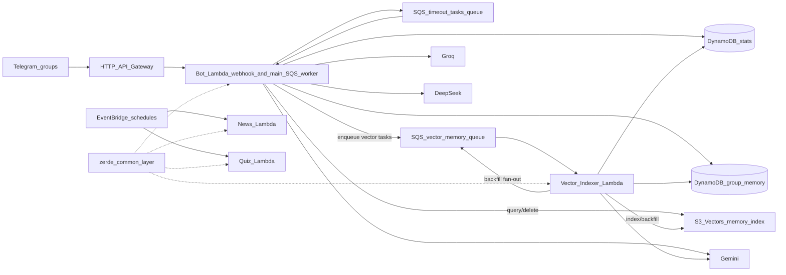

# AGENTS.md

This file guides Codex when working in this repository. Keep it current with `docs/ARCHITECTURE.md` and `.codex/skills/zerdebot-development/SKILL.md`.

## Commands

```bash
# Install dependencies
uv sync --frozen

# Validate Python behavior
uv run pytest tests/ -q
uv run pre-commit run --all-files

# Validate CDK infrastructure
cd infra && uv run cdk synth -c env=dev
cd infra && uv run cdk diff -c env=dev

# Deploy / destroy
cd infra && uv run cdk deploy -c env=dev
cd infra && uv run cdk destroy -c env=dev
```

When changing `infra/`, include meaningful `cd infra && uv run cdk diff -c env=dev` output in PR notes. If the diff is only environment config such as `CHAT_LANG_MAP`, say that explicitly.

## Git Workflow

- Create new work branches with conventional prefixes such as `feat/`, `fix/`, `docs/`, `chore/`, `refactor/`, or `test/`.
- Do not use `codex/` as a branch prefix in this repository.
- Use conventional commit-style commit and PR titles, for example `feat: improve RAG memory grounding` or `fix: scope self-reference retrieval`.
- Do not include `codex` or `[codex]` in commit messages or PR titles.

## Product Direction

ZerdeBot started as a simple serverless Telegram bot and LLM wrapper. It is now a **memory-enabled agentic Telegram group bot**:

- It observes opted-in group messages.
- It stores recent context, user profiles, long-term memory, daily summaries, and agent reply metadata in DynamoDB.
- It extracts long-term memory with cheap local candidate gates, bounded structured Gemini extraction, and rule-based fallback when Gemini is unavailable, disabled, over budget, or not warranted.
- It indexes long-term memory and high-information daily summaries in S3 Vectors for semantic RAG retrieval.
- Normal bot answers stay in short-term `AGENT_REPLY#...` metadata for thread continuity only; they are not embedded into semantic memory.
- It answers `/ask`, @mentions, and reply-to-Zerde follow-ups through a retrieval pipeline that gathers requester, profile, recent, long-term, and semantic context from a compact retrieval query that is separate from the full Gemini generation prompt.
- It supports explicit multimodal `/ask` for replied photos/screenshots, voice/audio, PDFs, and supported text/code/log files. Media is downloaded only in the async worker for explicit requests and official linked-channel post comments, not during generic webhook observation or ordinary proactive analysis.
- Reply-thread follow-ups carry the captured quoted source message, previous user request, and previous bot answer when available for generation, while semantic retrieval uses a shorter query based on the current follow-up, previous user request, and original source message.
- It may proactively answer ordinary group messages only after a short delayed candidate window plus a Groq/DeepSeek AI decision with recent and query-filtered long-term context. Linked channel posts mirrored into discussion groups use a separate immediate comment path.
- It still supports captcha, anti-spam, voteban, daily news, and quizzes.

RAG is one capability inside the agent. Do not treat vector search as the only source of truth; requester identity, recent context, target-user profiles, reply-thread context, and query-filtered long-term memory are also part of the answer path.

## Architecture



| Lambda | Package | Entry | Purpose |
|--------|---------|-------|---------|
| Bot | `src/bot/` | `main.py:lambda_handler` | API Gateway webhook and main SQS worker. Handles captcha, voteban, spam, `/ask`, agent replies, group memory, semantic retrieval, and cleanup commands. |
| Vector indexer | `src/bot/` | `vector_indexer_main.py:lambda_handler` | Dedicated vector memory queue consumer for `PROCESS_VECTOR_MEMORY` and `PROCESS_VECTOR_MEMORY_BACKFILL`. |
| News | `src/news/` | `main.py:lambda_handler` | Scheduled IT news digest. |
| Quiz | `src/quiz/` | `main.py:lambda_handler` | Scheduled and on-demand quiz workflow. |

Detailed architecture lives in `docs/ARCHITECTURE.md`.

## Bot Package Map

- `main.py` — detects API Gateway vs main SQS tasks and delegates.
- `vector_indexer_main.py` — consumes only vector memory SQS tasks.
- `app.py` — lazy wiring for Telegram client, dispatcher, captcha repo, and memory repo.
- `webhook.py` — verifies Telegram secret, screens spam, observes memory, filters irrelevant events, routes agent/commands.
- `services/sqs_task_router.py` — routes main and vector SQS task families and re-raises failures for retry/DLQ semantics.
- `services/group_memory.py` — stores recent group context, formats prompt context, requester/target-user profile context, and query-filtered long-term memory.
- `services/memory_retrieval.py` — Memory Retrieval Pipeline V1 for query intent, raw candidate retrieval, local scoring/dedupe, candidate-driven prompt packing, and source tracking.
- `services/memory_extractor.py` — structured long-term memory schema, Gemini extraction normalisation, rule fallback, and storage guards.
- `services/group_memory_processor.py` — async long-term extraction task orchestration, cheap Gemini candidate gating, extractor LLM budgets, and daily summaries.
- `services/group_agent.py` — agent trigger policy, ordinary proactive AI decision orchestration, linked-channel post immediate comments with provider fallback, reply-thread continuity, answer length/style policy.
- `services/ambient_reactions.py` — ambient emoji reaction eligibility, sampling, bounded context, strict classifier validation, cooldowns, provider fallback, and `setMessageReaction` task processing.
- `services/telegram_actor.py` — Telegram actor attribution helpers, including linked-channel discussion mirror detection and `sender_chat` actor selection.
- `services/telegram_media.py` — explicit `/ask` media detection, metadata-only references, bounded worker download preparation, and Gemini media part construction.
- `services/vector_memory.py` — embedding, S3 Vectors indexing, semantic retrieval, cleanup/backfill.
- `services/repositories/group_memory.py` — DynamoDB single-table layout for settings, messages, profiles, long-term memory, agent replies, vector status, proactive counters, and targeted memory deletion helpers.
- `services/ai/gemini_client.py` — Gemini calls for agent answers, multimodal linked-channel post comment decisions, summaries, embeddings.
- `services/ai/proactive_decision.py` — Groq then DeepSeek strict-JSON decision chain for ordinary proactive group answers.
- `services/ai/group_chat_reply_fallback.py` — DeepSeek then Groq text-only fallback chain for group answer generation when Gemini fails.
- `services/ai/channel_post_comment.py` — DeepSeek then Groq text-only fallback chain for linked-channel post comments when Gemini is unavailable after retries.
- `services/ai/ambient_reaction_classifier.py` — ambient reaction classifier chain: Gemini primary, then DeepSeek and Groq OpenAI-compatible fallbacks when configured.
- `services/spam/` — rule-based spam screening plus Groq async checks.

## Memory Table

Single table partitioned by `pk=CHAT#<chat_id>`:

- `SETTINGS` — memory/agent flags and optional chat `style_profile`.
- `MSG#<created_at_ms>#<message_id>` — recent non-command group messages, with reply-to ids, sender metadata, bot/self-bot flags, and simple thread root metadata when available.
- `USER#<user_id>` — profile from the user's own messages only.
- `USERNAME#<lower_username>` — per-chat username alias pointing to `USER#<user_id>` for direct target-profile lookup.
- `EVENT#...`, `USER_FACT#...`, `GROUP_FACT#...`, `JOKE#...` — long-term memories. Durable `JOKE#`
  items require high-confidence Gemini extraction or repeated evidence so one-off jokes do not over-pollute retrieval.
- `DAILY_SUMMARY#YYYY-MM-DD` — compressed daily group memory.
- `TERM#<term>#<created_at_ms>#<source_sk>` — bounded exact-term lexical index rows for long-term memories and daily summaries.
- `AGENT_REPLY#<bot_message_id>` — short-term bot answer text, triggering/current user message, optional quoted source-message context, optional compact media metadata/summary, parent bot message id, requester metadata, retrieval source metadata with deletion policy, and reason for reply-thread continuity, `/agent why`, `/agent wrong`, `/memory wrong`, and `/memory forget this`; not long-term semantic memory.
- `AMBIENT_REACTION#<created_at_ms>#<message_id>` — seven-day reaction metadata for cooldowns/debugging only; not long-term semantic memory.
- `BOT_COMMITMENT#...` — reserved future durable bot commitment rows for explicit command/admin flows only.
- `BOT_CORRECTION#...` — reserved future durable bot correction rows for explicit user/admin correction flows only.
- `VECTOR_BACKFILL` — cumulative vector backfill status with processed/enqueued/failure totals,
  start/update/finish timestamps, continuation tokens, and legacy `vector_backfill_*` fields.
- `PROACTIVE#YYYYMMDD` — daily proactive reply reservation counter.

Vectorizable prefixes are `EVENT#`, `USER_FACT#`, `GROUP_FACT#`, `JOKE#`, and high-information `DAILY_SUMMARY#` items. `AGENT_REPLY#` is excluded so normal bot answers never become long-term vector memory by accident. Fallback or empty live daily summaries stay in DynamoDB but are not enqueued for vector indexing.

Memory items include feedback/consolidation metadata such as `wrong_feedback_count`, `negative_feedback_count`,
`last_feedback_at`, `feedback_status`, and `superseded_by`.

Indexed memory items also carry `vector_document_hash`, `vector_schema_version`, `vector_embedding_model`, and `vector_dimensions` so duplicate SQS deliveries can skip unchanged items and future embedding migrations can redrive stale records explicitly.

Memory TTLs are type-specific: raw `MSG#...`, `AGENT_REPLY#...`, long-term memory, `DAILY_SUMMARY#...`, and `PROACTIVE#...` counters use their own retention env vars. `MSG#...`, long-term memory, and `DAILY_SUMMARY#...` fall back to `GROUP_MEMORY_RETENTION_DAYS` when omitted; `AGENT_REPLY#...` and `PROACTIVE#...` keep their existing short defaults unless explicitly configured. Long-term `expires_in_days` still records `expires_at` and uses the shorter DynamoDB TTL.

## SQS Tasks

- `CHECK_TIMEOUT` — captcha timeout enforcement.
- `SPAM_CHECK` — async Groq spam decision.
- `PROCESS_GROUP_ASK` — async explicit `/ask` answer.
- `PROCESS_PROACTIVE_CANDIDATE` — delayed ordinary proactive AI decision with Groq/DeepSeek and answer-generation fallback; linked-channel post candidates use the same worker task with zero delay, a dedicated comment prompt, Gemini retries, and DeepSeek/Groq text-only fallback.
- `PROCESS_AMBIENT_REACTION` — async sampled ambient reaction classifier; uses only bounded recent/reply text context and never writes long-term memory or vectors.
- `PROCESS_GROUP_MEMORY` — extract/store long-term memory from one message using structured Gemini extraction with rule fallback.
- `PROCESS_DAILY_GROUP_SUMMARIES` — daily summaries for configured groups.
- `PROCESS_VECTOR_MEMORY` — embed/index one memory item; consumed by the vector-indexer Lambda.
- `PROCESS_VECTOR_MEMORY_BACKFILL` — page through vectorizable memory and enqueue indexing; consumed by the vector-indexer Lambda.

Main task queue retention defaults to 1 day, vector-memory queue retention defaults to 4 days, and
both DLQs default to 14 days for incident inspection and redrive. Tune these at CDK deploy time with
`MAIN_TASK_QUEUE_RETENTION_DAYS`, `MAIN_TASK_DLQ_RETENTION_DAYS`,
`VECTOR_MEMORY_QUEUE_RETENTION_DAYS`, and `VECTOR_MEMORY_DLQ_RETENTION_DAYS`.

## Secrets And Config

- Deploy-time `.env` is loaded by `infra/stack.py` for non-secret CDK config and local runs.
- Runtime secrets live in SSM Parameter Store under `SSM_SECRET_PREFIX`, for example `/zerde/prod/bot-token`.
- Bot Lambda env names are `BOT_TOKEN`, `WEBHOOK_SECRET_TOKEN`, `GEMINI_API_KEY`, `GEMINI_EMBEDDING_API_KEY`, `GROQ_API_KEY`, and `DEEPSEEK_API_KEY`; avoid old informal names such as `TELEGRAM_BOT_TOKEN`.
- Telegram BotFather privacy mode must be disabled, or the bot must be an admin, for full group context.
- When adding or changing non-secret runtime/CDK env vars, update `.env.example`, `infra/stack.py`, relevant construct environment maps, `.github/workflows/deploy.yml`, `.github/workflows/pr_check.yml`, docs, and GitHub repo Actions variables with `gh variable set <NAME> --repo Bayashat/zerde-serverless-bot --body <value>`. Repo variables alone are ignored when workflow env mappings are missing.

## Key Design Decisions

- **No SnapStart**: low-frequency workloads and Python package trade-offs make SnapStart unnecessary here.
- **Bot Lambda for webhook and main SQS only**: `/ask`, spam, captcha, and memory extraction share the bot warm path.
- **Separate vector indexer Lambda and vector queue**: slower embedding/backfill/S3 Vectors work has independent concurrency, logs, alarms, and DLQ visibility so it does not block webhook or interactive `/ask` work.
- **Vector backfill observability**: `VECTOR_BACKFILL` keeps cumulative `processed_total`,
  `enqueued_total`, `failures_total`, `started_at`, `last_updated_at`, optional `finished_at`, and
  page continuation tokens while retaining legacy `vector_backfill_*` fields for compatibility.
- **Trust hierarchy for agent answers**: current user message and reply-thread context > requester profile for self-reference > target user's own profile > query-matched vector memory > query-filtered long-term memory > recent group chatter.
- **Prompt pollution control**: do not inject unfiltered recent long-term memories into answers; filter by query or use vector retrieval.
- **Vector retrieval discipline**: use chat metadata filters, requester filters for self-reference when available, and distance cutoffs before adding semantic memories to prompts.
- **Bot-output memory boundary**: ordinary `AGENT_REPLY#...` rows are short-term thread/explainability metadata only. Use a deliberate `BOT_COMMITMENT#...` or `BOT_CORRECTION#...` flow with permission/review checks before any bot-authored commitment or correction becomes durable memory.
- **Memory Retrieval Pipeline V1**: `services.memory_retrieval.build_agent_memory_context` retrieves profile, semantic, lexical, long-term, and recent candidates from `retrieval_query`, scores/dedupes them locally, renders prompt sections only from selected top candidates, and persists compact metadata for the selected retrieval sources used by `/agent why` and wrong-source feedback. Username target profiles use `USERNAME#...` aliases, exact lexical retrieval uses `TERM#...` index rows before falling back to recent legacy candidates, and negative feedback on a source lowers its future retrieval score.
- **Explicit multimodal boundary**: ZerdeBot does not automatically analyze every group media message. It analyzes media only when explicitly asked through `/ask` or an explicit mention/reply path, plus the official linked-channel post comment path. These flows send only `media_ref` metadata through SQS, download media in the async worker, and store only compact media metadata/summary in `AGENT_REPLY#...`. Raw bytes, downloaded files, OCR/transcripts, and media-derived facts are not long-term memory and are not indexed in S3 Vectors by default.
- **Ambient reaction boundary**: ambient reactions are enabled by default and must stay ephemeral. Ordinary ambient reactions may use bounded recent/reply text context for classification, but must not use long-term memory, vector retrieval/indexing, profile context, media analysis, or persisted classifier context. Command text and sensitive/hostile/serious text may reach the classifier, but prompts must require a strong context-safe reaction and avoid reactions that trivialize, mock, endorse, or escalate harm. Official linked-channel posts force a reaction attempt, bypass sampling/cooldowns/rate caps, and fall back to 👀 when provider output is unavailable or says no. Only short-lived `AMBIENT_REACTION#...` cooldown/debug rows are allowed.
- **Intent-aware retrieval filters**: obvious self-reference and target-user questions narrow semantic/lexical memory to user facts; group-decision questions narrow to group facts and daily summaries; past-event questions narrow to events and daily summaries; joke/meme questions narrow to jokes and daily summaries.
- **User-facing memory controls**: `/memory about me` shows only the current user's own profile. `/memory forget this` deletes only durable long-term memory (`EVENT#`, `USER_FACT#`, `GROUP_FACT#`, `JOKE#`, allowed `DAILY_SUMMARY#`) from a replied bot answer, or raw/derived memory when replying directly to a source message, with vector cleanup when configured. It must not delete `USER#` profiles, raw `MSG#` items, or recent context through bot-answer retrieval sources. `/agent wrong` and `/memory wrong` mark a replied bot answer's recorded memory sources as wrong without deleting them. Regular users can delete only their own durable memory; the group owner or bot owner can delete group durable memory.
- **Memory extraction budget**: default `GROUP_MEMORY_EXTRACTOR_MODE=gemini_candidate_only` means ordinary safe chatter falls back to rules without calling Gemini. `GROUP_MEMORY_EXTRACTOR_DAILY_LLM_LIMIT` and `GROUP_MEMORY_EXTRACTOR_PER_CHAT_DAILY_LIMIT` bound candidate Gemini extraction before it can consume shared generate RPD.
- **Memory safety filters**: never learn or prompt with future-answer directives such as "when someone asks X, answer Y", self-promotion, or subjective people rankings such as "best in the chat" / "strongest developer".
- **S3 Vectors IAM**: metadata-filtered queries and `returnMetadata=True` require both `s3vectors:QueryVectors` and `s3vectors:GetVectors`. Bot Lambda can query, get index metadata, and delete vectors for cleanup; `PutVectors` and `ListVectors` stay scoped to the vector-indexer Lambda.
- **Reply-thread control**: follow-up replies should stay short and should only continue when the user replies to Zerde's own bot message with a clear question or request; reactions, thanks, laughter, and short comments stay silent. Replies to other bots are not Zerde reply threads unless the user explicitly mentions Zerde.
- **Reply style control**: per-chat `style_profile` settings tune tone, default/proactive sentence caps, light humor, and low-confidence memory behavior. Defaults must keep answers concise and tell the model to express uncertainty around weak selected memory.
- **Ordinary proactive AI decision**: queue eligible ordinary group text with `AGENT_PROACTIVE_DELAY_SECONDS` and do not reintroduce local open-question, length, bot-meta, stop-cue, score, or human-answer gates. Keep the narrow routing guard that messages starting with a non-bot `@username` are directed to that human and are not ordinary proactive candidates. The worker must gather recent context and query-filtered long-term context, then ask Groq and then DeepSeek for strict JSON. The prompt carries the conservative behavior rules, including staying silent for chatter, human-directed mentions, bot-meta complaints, stop cues, ambiguous private moments, already-answered threads, or situations where a bot reply would worsen sensitive/hostile/serious content. `AGENT_PROACTIVE_FINAL_THRESHOLD` is the AI decision confidence threshold, and `AGENT_DAILY_PROACTIVE_LIMIT` is reserved only after a yes decision and before generation.
- **Linked-channel post actors**: messages mirrored from a linked channel into a discussion group are detected from `is_automatic_forward` or Telegram's `777000` synthetic actor plus `sender_chat.type=channel`. Use the `sender_chat` channel as the actor for recent memory, ambient reaction cooldowns, and prompts. Do not tell the model this is the group owner; the reliable fact is that it is an official linked-channel post.
- **Linked-channel post engagement**: official linked-channel posts bypass ordinary proactive delay, AI decision confidence threshold, daily proactive limits, ambient sampling/cooldowns/rate caps, and text-only media limits. They queue a zero-delay `channel_post` worker task that comments with a dedicated Gemini prompt and may analyze supported attached media ephemerally. If Gemini is unavailable after three attempts or cannot be used, the worker falls back to DeepSeek and then Groq with text-only context. If every provider fails, the task error is allowed to retry/DLQ instead of being silently consumed. Ordinary media still stays out of the ordinary proactive path.
- **Gemini empty responses**: HTTP 200 responses without candidate text are non-retryable for interactive `/ask`; log safe response-shape fields such as block reason, finish reason, and candidate counts, then notify the user without requeueing.
- **Structured logging**: use `zerde_common` and avoid logging full prompts, model responses, API keys, Telegram files, or user secrets.
- **Vector observability**: retrieval and indexing success paths emit INFO logs with counts, filters, distance cutoffs, and vector dimensions; do not rely only on ERROR logs to confirm vector health.

## Documentation Maintenance

When making a large change to architecture, memory, agent behavior, SQS tasks, data schemas, environment variables, or infrastructure:

1. Update `docs/ARCHITECTURE.md`.
2. Update this file.
3. Update `.codex/skills/zerdebot-development/SKILL.md`.
4. Update `README.md`, `docs/README_kk.md`, and `docs/README_ru.md` when user-visible behavior changes.
5. Update `docs/LOCAL_TESTING.md` and `.env.example` when setup/config changes.
6. Update `docs/telegram_history_import.md` when import or vector indexing behavior changes.

Historical documents under `docs/superpowers/` are plan snapshots, not current architecture references.
