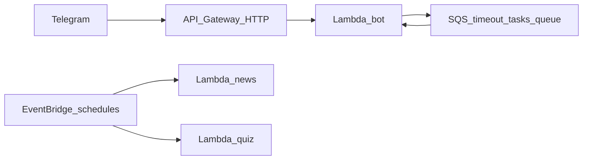

# AGENTS.md

This file provides guidance to Codex (Codex.ai/code) when working with code in this repository.

## Commands

```bash
# Install dependencies
uv sync --frozen

# Activate virtual environment
source .venv/bin/activate

# Validate CDK infrastructure (run from infra/)
cd infra && uv run cdk synth -c env=dev
cd infra && uv run cdk diff -c env=dev

# Deploy to AWS
cd infra && uv run cdk deploy -c env=dev

# Destroy stack
cd infra && uv run cdk destroy -c env=dev

# Tests and lint
uv run pytest tests/ -q
uv run pre-commit run --all-files
```

Pre-commit runs Black, Isort, and Flake8. Run `uv run pre-commit install` once locally.

When changing `infra/`, include `cd infra && uv run cdk diff -c env=dev` output in PR descriptions.

## Architecture (current)

ZerdeBot is a serverless Telegram bot and related jobs on AWS (CDK in `infra/`). Python Lambdas share a **Lambda Layer** with small utilities only (`src/shared/python/zerde_common/`): typed env helpers, SSM secret batch load, JSON logging helpers, provider error types, log redaction helpers.



| Lambda | Package | Entry | Purpose |
|--------|---------|-------|---------|
| Bot | `src/bot/` | `main.py:lambda_handler` | API Gateway: verify secret, spam, dispatcher. Same function consumes SQS: `CHECK_TIMEOUT`, `PROCESS_EXPLAIN`, `SPAM_CHECK` (shared container = lower /wtf latency). |
| News | `src/news/` | `main.py:lambda_handler` | Scheduled digest pipeline |
| Quiz | `src/quiz/` | `main.py:lambda_handler` | Scheduled quiz + on-demand via bot invoke |

**Bot package (`src/bot/`):**

- `main.py` — one handler: SQS path → `services.sqs_task_router.process_sqs_event`; else → `webhook.handle_event`
- `app.py` — lazy wiring: `get_bot()`, `get_dispatcher()`, `get_captcha_repo()` (avoid eager init / cold-start cost)
- `webhook.py` — API Gateway path: secret verification, spam screening service, dispatcher
- `services/sqs_task_router.py` — SQS record routing; failures **re-raise** so SQS retry + DLQ apply
- `services/spam/screening_service.py` — rule-based spam + SQS hand-off for Groq check
- `core/config.py` — non-secret env at import; when `SSM_SECRET_PREFIX` is set, all bot secrets are **batch-loaded once** at import, then getters read `os.environ`
- `core/dispatcher.py`, `core/translations.py`, `services/handlers/`, `services/repositories/`, `services/telegram.py` — as before

**Shared layer:** `src/shared/python/zerde_common/` — wired in CDK to bot, news, and quiz Lambdas.

**Infrastructure (`infra/`):**

- `stack.py` — `MessagingConstruct`, `BotConstruct`, `NewsConstruct`, `QuizConstruct`, shared layer, CloudWatch alarms
- `components/bot.py` — one bot Lambda, stats DynamoDB, HTTP API, SQS send + consume
- `components/messaging.py` — main SQS queue + **DLQ** (`self.dlq`, `self.queue`)
- `components/news.py`, `components/quiz.py` — scheduled Lambdas + prod EventBridge rules
- `components/observability.py` — Lambda errors/throttles/duration p95 + DLQ visible alarms (no SNS in repo; subscribe in console if needed)
- `components/zerde_layer.py` — shared Python layer asset

## Secrets and config

- Deploy-time `.env` is loaded in `stack.py` for **non-secret** CDK context only.
- Runtime secrets live in **SSM Parameter Store** under `SSM_SECRET_PREFIX` (e.g. `/zerde/{env}/bot-token`). Bot loads all mapped keys in **one** `GetParameters` call at `core.config` import; news/quiz use their own policies.
- Local/tests: set env vars directly; leave `SSM_SECRET_PREFIX` empty to skip SSM.

Lambda env names differ from informal names: `BOT_TOKEN`, `WEBHOOK_SECRET_TOKEN` (not `TELEGRAM_*` in Lambda env).

## Key design decisions

- **No SnapStart** on these Lambdas (low-frequency / different trade-offs).
- **One bot Lambda** (API + SQS) so `/wtf` and similar async paths reuse the same warm container; IAM covers webhook + SQS.
- **Synchronous Telegram updates** via API Gateway; async work via SQS (`/wtf`, spam check, captcha timeout).
- **Structured JSON logs** via `zerde_common` + per-handler `LoggerAdapter`; no AWS Lambda Powertools dependency in the runtime bundle (keeps cold start lean).
- **PythonFunction** (`aws_lambda_python_alpha`) bundles each Lambda from its `requirements.txt`; Docker required at synth/deploy time.

## Naming constants

`CONSTRUCT_PREFIX` ("ZerdeServerless") and `RESOURCE_PREFIX` ("zerde-serverless") live in `components/constants.py` — do not duplicate as string literals in constructs.
