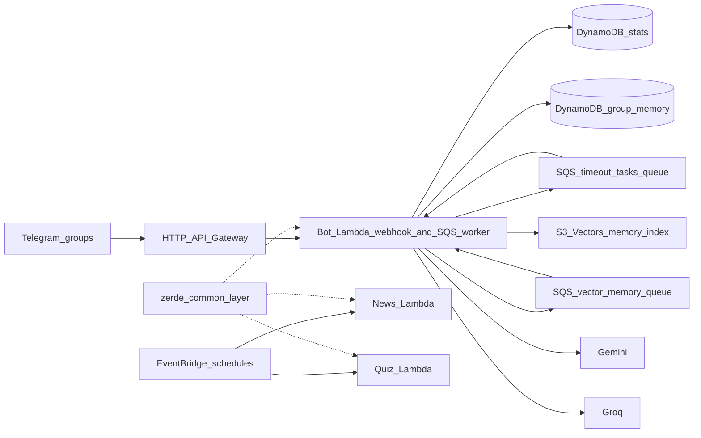

# AGENTS.md

This file guides Codex when working in this repository. Keep it current with `docs/ARCHITECTURE.md` and `.codex/skills/zerdebot-development/SKILL.md`.

## Commands

```bash
# Install dependencies
uv sync --frozen

# Validate Python behavior
uv run pytest tests/ -q
uv run pre-commit run --all-files

# Validate CDK infrastructure
cd infra && uv run cdk synth -c env=dev
cd infra && uv run cdk diff -c env=dev

# Deploy / destroy
cd infra && uv run cdk deploy -c env=dev
cd infra && uv run cdk destroy -c env=dev
```

When changing `infra/`, include meaningful `cd infra && uv run cdk diff -c env=dev` output in PR notes. If the diff is only environment config such as `CHAT_LANG_MAP`, say that explicitly.

## Product Direction

ZerdeBot started as a simple serverless Telegram bot and LLM wrapper. It is now a **memory-enabled agentic Telegram group bot**:

- It observes opted-in group messages.
- It stores recent context, user profiles, long-term memory, daily summaries, and agent reply metadata in DynamoDB.
- It indexes long-term memory in S3 Vectors for semantic RAG retrieval.
- It answers `/ask`, @mentions, and reply-to-bot follow-ups with structured context.
- It may proactively answer only after conservative local and LLM social-timing gates.
- It still supports captcha, anti-spam, voteban, daily news, and quizzes.

RAG is one capability inside the agent. Do not treat vector search as the only source of truth; recent context, target-user profiles, reply-thread context, and query-filtered long-term memory are also part of the answer path.

## Architecture



| Lambda | Package | Entry | Purpose |
|--------|---------|-------|---------|
| Bot | `src/bot/` | `main.py:lambda_handler` | API Gateway webhook and SQS worker. Handles captcha, voteban, spam, `/ask`, agent replies, group memory, vector indexing, and cleanup commands. |
| News | `src/news/` | `main.py:lambda_handler` | Scheduled IT news digest. |
| Quiz | `src/quiz/` | `main.py:lambda_handler` | Scheduled and on-demand quiz workflow. |

Detailed architecture lives in `docs/ARCHITECTURE.md`.

## Bot Package Map

- `main.py` — detects SQS vs API Gateway and delegates.
- `app.py` — lazy wiring for Telegram client, dispatcher, captcha repo, and memory repo.
- `webhook.py` — verifies Telegram secret, screens spam, observes memory, filters irrelevant events, routes agent/commands.
- `services/sqs_task_router.py` — routes SQS tasks and re-raises failures for retry/DLQ semantics.
- `services/group_memory.py` — stores recent group context, formats prompt context, target-user profile context, and query-filtered long-term memory.
- `services/group_memory_processor.py` — async long-term extraction and daily summaries.
- `services/group_agent.py` — agent trigger policy, proactive gating, reply-thread continuity, answer-length policy.
- `services/vector_memory.py` — embedding, S3 Vectors indexing, semantic retrieval, cleanup/backfill.
- `services/repositories/group_memory.py` — DynamoDB single-table layout for settings, messages, profiles, long-term memory, agent replies, vector status, proactive counters.
- `services/ai/gemini_client.py` — Gemini calls for agent answers, proactive decisions, summaries, embeddings.
- `services/spam/` — rule-based spam screening plus Groq async checks.

## Memory Table

Single table partitioned by `pk=CHAT#<chat_id>`:

- `SETTINGS` — memory/agent flags.
- `MSG#<created_at_ms>#<message_id>` — recent non-command group messages.
- `USER#<user_id>` — profile from the user's own messages only.
- `EVENT#...`, `USER_FACT#...`, `GROUP_FACT#...`, `JOKE#...` — long-term memories.
- `DAILY_SUMMARY#YYYY-MM-DD` — compressed daily group memory.
- `AGENT_REPLY#<bot_message_id>` — bot answer text, triggering user message, and reason for reply-thread continuity and `/agent why`.
- `VECTOR_BACKFILL` — vector backfill status.
- `PROACTIVE#YYYYMMDD` — daily proactive reply reservation counter.

Vectorizable prefixes are `EVENT#`, `USER_FACT#`, `GROUP_FACT#`, `JOKE#`, and `DAILY_SUMMARY#`.

## SQS Tasks

- `CHECK_TIMEOUT` — captcha timeout enforcement.
- `SPAM_CHECK` — async Groq spam decision.
- `PROCESS_GROUP_ASK` — async explicit `/ask` answer.
- `PROCESS_GROUP_MEMORY` — classify/store long-term memory from one message.
- `PROCESS_DAILY_GROUP_SUMMARIES` — daily summaries for configured groups.
- `PROCESS_VECTOR_MEMORY` — embed/index one memory item.
- `PROCESS_VECTOR_MEMORY_BACKFILL` — page through vectorizable memory and enqueue indexing.

## Secrets And Config

- Deploy-time `.env` is loaded by `infra/stack.py` for non-secret CDK config and local runs.
- Runtime secrets live in SSM Parameter Store under `SSM_SECRET_PREFIX`, for example `/zerde/prod/bot-token`.
- Bot Lambda env names are `BOT_TOKEN`, `WEBHOOK_SECRET_TOKEN`, `GEMINI_API_KEY`, `GEMINI_EMBEDDING_API_KEY`, `GROQ_API_KEY`, and `DEEPSEEK_API_KEY`; avoid old informal names such as `TELEGRAM_BOT_TOKEN`.
- Telegram BotFather privacy mode must be disabled, or the bot must be an admin, for full group context.

## Key Design Decisions

- **No SnapStart**: low-frequency workloads and Python package trade-offs make SnapStart unnecessary here.
- **One bot Lambda for webhook and SQS**: `/ask`, spam, captcha, memory, and vector tasks share warm containers and common wiring.
- **Separate vector queue**: slower embedding/backfill work does not block real-time timeout/spam/ask tasks.
- **Trust hierarchy for agent answers**: current user message and reply-thread context > target user's own profile > query-matched vector memory > query-filtered long-term memory > recent group chatter.
- **Prompt pollution control**: do not inject unfiltered recent long-term memories into answers; filter by query or use vector retrieval.
- **Reply length control**: follow-up replies should stay short unless the user explicitly asks for detail.
- **Structured logging**: use `zerde_common` and avoid logging full prompts, model responses, API keys, Telegram files, or user secrets.

## Documentation Maintenance

When making a large change to architecture, memory, agent behavior, SQS tasks, data schemas, environment variables, or infrastructure:

1. Update `docs/ARCHITECTURE.md`.
2. Update this file.
3. Update `.codex/skills/zerdebot-development/SKILL.md`.
4. Update `README.md`, `docs/README_kk.md`, and `docs/README_ru.md` when user-visible behavior changes.
5. Update `docs/LOCAL_TESTING.md` and `.env.example` when setup/config changes.
6. Update `docs/telegram_history_import.md` when import or vector indexing behavior changes.

Historical documents under `docs/superpowers/` are plan snapshots, not current architecture references.
