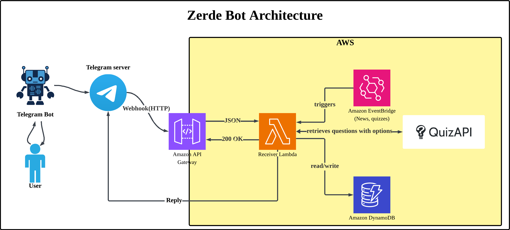
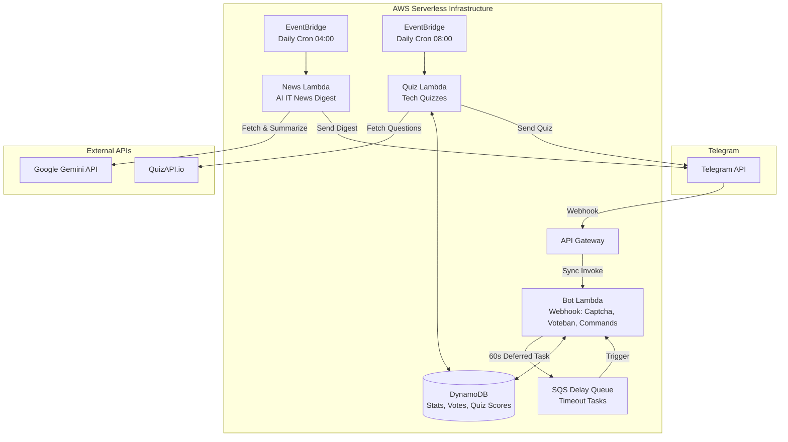

# 🛡️ Zerde Bot

[ 🇬🇧 English ](README.md) | [ 🇰🇿 Қазақша ](docs/README_KK.md) | [ 🇷🇺 Русский ](docs/README_RU.md)




**Zerde** is a production-ready, serverless Telegram bot for IT community management — handling anti-spam, community voting, daily AI-powered news digests, and interactive tech quizzes, all without managing a single server.

Built with **Python 3.13** and **AWS CDK v2**. Running 24/7 on AWS Free Tier at **$0/month**.

---

## 🌟 Built on a Serverless Starter Template ($0 Cost)

Curious about how to build a bot like this from scratch without paying for servers?

**Zerde Bot** is a real-world implementation built on top of the **[serverless-tg-bot-starter](https://github.com/Bayashat/serverless-tg-bot-starter)** — an open-source template for building production-grade serverless Telegram bots on AWS.

**The biggest advantage? It costs exactly $0/month.** Because it uses a 100% serverless architecture (API Gateway, Lambda, DynamoDB, SQS, CDK), you only pay for what you use. For most Telegram bots, the traffic falls entirely within the generous AWS Free Tier.

If you want to build your own bot with the same robust architecture, zero maintenance, and zero hosting fees, start with the template! It gives you the wiring, CI/CD, and project structure out of the box.

---

## ✨ Key Features

| Feature | Description |
|---------|-------------|
| 🛡️ **Smart Captcha & Anti-Spam** | Automatically mutes new members until they verify via an inline button. Unverified users are kicked after **60 seconds** using an SQS Delay Queue. |
| 🗳️ **Community Voteban** | Democratized moderation. Reply to a message with `/voteban` to initiate a vote. Requires 7 community votes to ban or forgive a user. |
| 📰 **AI-Powered Daily News** | Daily EventBridge cron triggers a Lambda to fetch IT news, summarize it via **Google Gemini API** in Kazakh, Russian, and Chinese, and broadcast it to groups. |
| 🧠 **Interactive IT Quizzes** | Automated daily tech quizzes sourced from QuizAPI. The bot tracks individual scores, maintains daily streaks, and features a community leaderboard. |
| 📊 **Community Analytics** | Comprehensive tracking of joins, verification success rates, and moderation stats per group. |
| ⚡ **Zero-Cost Serverless** | 100% Infrastructure as Code (AWS CDK). Uses Lambda **SnapStart** for ultra-fast cold starts. Stays entirely within the AWS Free Tier ($0/month). |

---

## 🏗️ Architecture

The infrastructure consists of three fully independent Lambda functions sharing no code, achieving strict isolation and clean architecture:



| Lambda Component | Trigger Source | Purpose |
|------------------|----------------|---------|
| `src/bot/` | API Gateway + SQS | Handles Telegram webhooks synchronously. Manages captcha verifications, voteban sessions, quiz scoring, and community stats. |
| `src/news/` | EventBridge Cron | Runs daily (04:00 UTC). Fetches tech news, summarizes it using AI, and pushes multilingual digests to target chats. |
| `src/quiz/` | EventBridge Cron | Runs daily (08:00 UTC). Fetches developer quizzes, translates them if necessary, and dispatches them to community chats. |

---

## 🤖 Bot Commands

| Command | Who | Description |
|---------|-----|-------------|
| `/start` | Everyone | Restart the bot and view instructions |
| `/help` | Everyone | Show usage guide and rules |
| `/ping` | Everyone | Health check — confirms bot is alive |
| `/support` | Everyone | Get developer contact info |
| `/stats` | Admins | Community statistics and activity level |
| `/voteban` | Everyone | Reply to a message to start a ban vote |
| `/quizstats` | Everyone | Your personal quiz score, streak, and rank |

---

## ⚙️ CI/CD Setup (GitHub Actions)

This repository includes a GitHub Actions workflow for automated deployment via OIDC (no long-lived AWS keys).

We provide a setup script to automate the IAM configuration:

```bash
# Usage: ./scripts/setup_oidc.sh <GITHUB_ORG/REPO>
./scripts/setup_oidc.sh Bayashat/zerde-serverless-bot
```

**What this script does:**

- Creates an OIDC Provider in IAM (if missing).
- Creates an IAM Role (`GitHubAction-Deploy-TelegramBot`) that trusts your specific GitHub repository.
- Outputs the **AWS_ROLE_ARN** to add as a GitHub Repository Secret.

---

## 🛠️ Contributing

We welcome contributions. See [CONTRIBUTING.md](CONTRIBUTING.md) for development setup (clone, uv, CDK, pre-commit) and PR process.

For a full walkthrough — AWS account, new bot, token, deploy from scratch — see [Local Testing Guide](docs/LOCAL_TESTING.md).

---

## 📄 License

This project is licensed under the **MIT License**.
