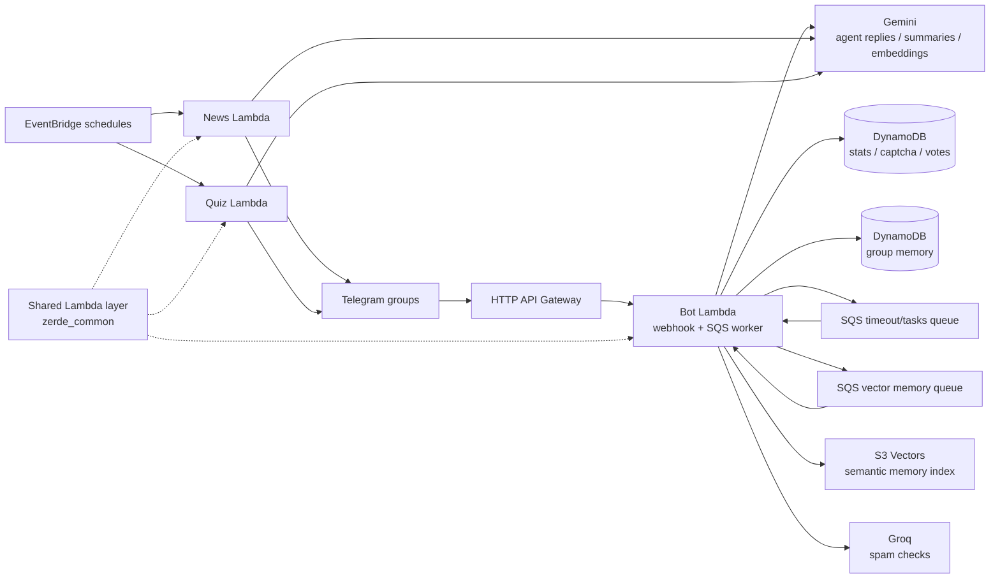

# Zerde Bot

[English](README.md) | [Қазақша](docs/README_kk.md) | [Русский](docs/README_ru.md)


**Zerde** is a serverless Telegram bot for IT communities. It started as a simple LLM wrapper and community-management bot; it is now an **agentic group-chat bot with RAG memory**. It can answer explicit `/ask` prompts, follow reply threads, remember group context, retrieve relevant long-term memories, and decide when it is socially useful to join a conversation.

The bot still handles moderation, captcha, voteban, daily AI news digests, and tech quizzes. The current architecture is optimized for small community workloads on AWS serverless infrastructure.

---

## What Changed

Zerde is no longer "just call an LLM with the latest message." The bot now has:

- **Recent memory**: non-command group messages stored in DynamoDB as `MSG#...`.
- **User profiles**: lightweight per-user context derived from each user's own messages.
- **Long-term memory**: extracted `EVENT#...`, `USER_FACT#...`, `GROUP_FACT#...`, `JOKE#...`, and `DAILY_SUMMARY#...` items.
- **Vector RAG**: long-term memories embedded with Gemini and indexed in S3 Vectors for semantic retrieval.
- **Agent behavior**: explicit `/ask`, @mention handling, self-reference grounding, reply-to-bot thread continuity, conservative proactive reply gating, reply-length budgeting, and `/agent why`.
- **Memory controls**: `/memory`, `/agent`, `/memory forget me` with related vector/summary cleanup, and owner-only group cleanup commands.

RAG means **Retrieval-Augmented Generation**: retrieve relevant memory first, then ask the LLM to answer with that context. Zerde uses RAG as one layer inside a larger group-chat agent.

---

## Key Features

| Feature | Description |
|---------|-------------|
| Group-chat agent | Answers `/ask`, @mentions, and replies to bot messages with requester, recent, profile, long-term, and semantic memory context. |
| RAG memory | Stores group memory in DynamoDB and indexes long-term memory in S3 Vectors for query-matched, distance-filtered retrieval. |
| Reply thread continuity | Records bot answers in `AGENT_REPLY#...` items so follow-up replies know what the bot just said. |
| Social timing | Proactive replies pass local heuristics, recent bot activity penalties, Gemini judgment, and per-chat daily limits. |
| Smart captcha and anti-spam | Mutes new members until verification and routes suspicious messages through rule-based and Groq checks. |
| Community voteban | Lets communities vote to ban or forgive by replying with `/voteban`. |
| Daily AI news | EventBridge-triggered news Lambda summarizes tech news through Gemini/DeepSeek-compatible provider paths. |
| IT quizzes | Scheduled and on-demand quiz Lambda sends multilingual developer quizzes and tracks scores. |
| Serverless operations | AWS CDK manages Lambda, API Gateway, DynamoDB, SQS, EventBridge, S3 Vectors, IAM, and alarms. |

---

## Architecture


```mermaid
flowchart LR
  TG["Telegram groups"] --> APIGW["HTTP API Gateway"]
  APIGW --> BOT["Bot Lambda<br/>webhook + SQS worker"]

  BOT --> STATS[("DynamoDB<br/>stats / captcha / votes")]
  BOT --> MEMORY[("DynamoDB<br/>group memory")]
  BOT --> MAINQ["SQS timeout/tasks queue"]
  MAINQ --> BOT

  BOT --> VQ["SQS vector memory queue"]
  VQ --> BOT
  BOT --> S3V["S3 Vectors<br/>semantic memory index"]

  BOT --> GEMINI["Gemini<br/>agent replies / summaries / embeddings"]
  BOT --> GROQ["Groq<br/>spam checks"]

  EB["EventBridge schedules"] --> NEWS["News Lambda"]
  EB --> QUIZ["Quiz Lambda"]
  NEWS --> GEMINI
  QUIZ --> GEMINI
  NEWS --> TG
  QUIZ --> TG

  LAYER["Shared Lambda layer<br/>zerde_common"] -.-> BOT
  LAYER -.-> NEWS
  LAYER -.-> QUIZ
```

| Component | Trigger | Responsibility |
|-----------|---------|----------------|
| `src/bot/` | API Gateway + SQS | Telegram webhook, captcha, voteban, spam screening, `/ask`, agent replies, memory writes, vector indexing tasks. |
| `src/news/` | EventBridge | Scheduled multilingual IT news digest. |
| `src/quiz/` | EventBridge + bot invoke | Scheduled and on-demand developer quizzes. |
| `src/shared/python/zerde_common/` | Lambda layer | Shared config, secret loading, logging, redaction, and provider error helpers. |
| `infra/` | CDK | Serverless infrastructure, queues, tables, vector bucket/index, alarms, and Lambda wiring. |

For the deeper developer map, see [docs/ARCHITECTURE.md](docs/ARCHITECTURE.md).

---

## Bot Commands

| Command | Who | Description |
|---------|-----|-------------|
| `/start` | Everyone | Restart the bot and view instructions. |
| `/help` | Everyone | Show usage guide and available commands. |
| `/ping` | Everyone | Health check. |
| `/support` | Everyone | Developer contact info. |
| `/stats` | Admins | Community statistics. |
| `/voteban` | Everyone | Reply to a message to start a ban vote. |
| `/quizstats` | Everyone | Personal quiz score, streak, and rank. |
| `/ask <question>` | Everyone in memory-enabled groups | Ask the agent; can be used as a reply to another message and understands “who am I” from requester identity. |
| `/memory on/off/status/forget ...` | Group owner or bot owner for settings | Manage group memory and cleanup, including user-related vectors and matching daily summaries. |
| `/agent on/off/status/why` | Group owner or bot owner for settings | Manage agent participation and inspect why the bot replied. `/agent off` disables proactive, mention, and reply-thread participation; `/ask` remains available if memory is on. |

---

## Development

```bash
uv sync --frozen
uv run pytest tests/ -q
uv run pre-commit run --all-files
```

Infrastructure validation:

```bash
cd infra
uv run cdk synth -c env=dev
uv run cdk diff -c env=dev
```

See [CONTRIBUTING.md](CONTRIBUTING.md) for setup and [docs/LOCAL_TESTING.md](docs/LOCAL_TESTING.md) for a full AWS + Telegram walkthrough.

---

## History

Zerde was originally built from the [serverless-tg-bot-starter](https://github.com/Bayashat/serverless-tg-bot-starter) template. That starter remains useful for simple serverless Telegram bots. This repository has since grown into a memory-enabled agentic bot with separate news and quiz workloads.

---

## License

This project is licensed under the MIT License.
