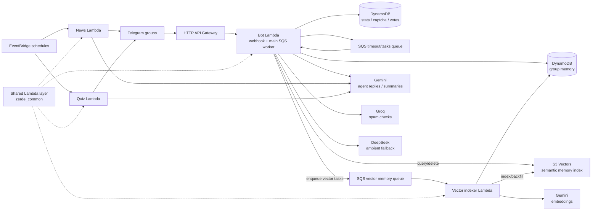

# Zerde Bot

[English](README.md) | [Қазақша](docs/README_kk.md) | [Русский](docs/README_ru.md)


**Zerde** is a serverless Telegram bot for IT communities. It started as a simple LLM wrapper and community-management bot; it is now an **agentic group-chat bot with RAG memory**. It can answer explicit `/ask` prompts, follow reply threads, remember group context, retrieve relevant long-term memories, and decide when it is socially useful to join a conversation.

The bot still handles moderation, captcha, voteban, daily AI news digests, and tech quizzes. The current architecture is optimized for small community workloads on AWS serverless infrastructure.

---

## What Changed

Zerde is no longer "just call an LLM with the latest message." The bot now has:

- **Recent memory**: non-command group messages stored in DynamoDB as `MSG#...`.
- **User profiles**: lightweight per-user context derived from each user's own messages.
- **Long-term memory**: candidate-gated, budgeted schema extraction for `EVENT#...`, `USER_FACT#...`, `GROUP_FACT#...`, conservative `JOKE#...`, and `DAILY_SUMMARY#...` items, with rule fallback.
- **Hybrid RAG**: long-term memories embedded with Gemini for S3 Vectors semantic retrieval, plus DynamoDB lexical fallback and local reranking.
- **Agent behavior**: explicit `/ask`, @mention handling, self-reference grounding, reply-to-bot thread continuity, linked-channel post discussion starters, delayed conservative proactive reply gating, reply-length/style budgeting, and `/agent why` source summaries.
- **Ambient reactions**: optional emoji reactions to sampled high-signal group messages, classified through Gemini with DeepSeek/Groq fallback and processed asynchronously without writing long-term memory.
- **Explicit media understanding**: `/ask` can be used as a reply to photos/screenshots, voice/audio, PDFs, and supported text/code/log files. Zerde does not automatically analyze every group media message.
- **Memory controls**: `/memory`, `/agent`, `/memory about me`, `/memory forget me`, `/memory forget this` durable source cleanup, and `/agent wrong` / `/memory wrong` feedback with related vector cleanup and owner-only group cleanup commands.
- **Bot output boundary**: normal bot answers are stored only as short-term `AGENT_REPLY#...` thread metadata, not embedded into semantic memory. Durable bot-authored memory is reserved for explicit future `BOT_COMMITMENT#...` or `BOT_CORRECTION#...` flows.

ZerdeBot does not automatically analyze every group media message. It analyzes media only when explicitly asked via `/ask` or an explicit mention/reply path. Media analysis is ephemeral and is not written into long-term memory or vector storage by default. The bot does not store raw bytes or downloaded files; only compact media metadata/summary may be stored in short-lived `AGENT_REPLY#...` rows for follow-up continuity.

RAG means **Retrieval-Augmented Generation**: retrieve relevant memory first, then ask the LLM to answer with that context. Zerde uses RAG as one layer inside a larger group-chat agent.

---

## Key Features

| Feature | Description |
|---------|-------------|
| Group-chat agent | Answers `/ask`, @mentions, and replies to bot messages with requester, recent, profile, long-term, lexical, and semantic memory context. |
| Explicit multimodal `/ask` | Reply to photos/screenshots, voice/audio, PDFs, or supported text/code/log files with `/ask`; the async worker reads that media for the current answer only. |
| RAG memory | Stores group memory in DynamoDB, extracts long-term memory with a structured Gemini schema plus rule fallback, indexes high-information memory in S3 Vectors for semantic retrieval, and uses exact-term DynamoDB fallback plus local reranking. |
| Reply thread continuity | Records bot answers in short-term `AGENT_REPLY#...` items so follow-up replies know what the bot just said; these rows are not semantic/vector memory. |
| Social timing | Proactive replies are delayed briefly, then pass local heuristics, human-answer checks, recent bot activity penalties, Gemini judgment, and per-chat daily limits. Linked channel posts mirrored into discussion groups can use a separate short discussion-starter prompt. |
| Ambient reactions | Optional `setMessageReaction` presence feature for funny, useful, thoughtful, warm, or interesting text messages; enabled by default, sampled, and rate-limited. |
| Smart captcha and anti-spam | Mutes new members until verification and routes suspicious messages through rule-based and Groq checks. |
| Community voteban | Lets communities vote to ban or forgive by replying with `/voteban`. |
| Daily AI news | EventBridge-triggered news Lambda summarizes tech news through Gemini/DeepSeek-compatible provider paths. |
| IT quizzes | Scheduled and on-demand quiz Lambda sends multilingual developer quizzes and tracks scores. |
| Serverless operations | AWS CDK manages Lambda, API Gateway, DynamoDB, SQS, EventBridge, S3 Vectors, IAM, and alarms. |

---

## Architecture


```mermaid
flowchart LR
  TG["Telegram groups"] --> APIGW["HTTP API Gateway"]
  APIGW --> BOT["Bot Lambda<br/>webhook + main SQS worker"]

  BOT --> STATS[("DynamoDB<br/>stats / captcha / votes")]
  BOT --> MEMORY[("DynamoDB<br/>group memory")]
  BOT --> MAINQ["SQS timeout/tasks queue"]
  MAINQ --> BOT

  BOT -- "enqueue vector tasks" --> VQ["SQS vector memory queue"]
  VQ --> VIDX["Vector indexer Lambda"]
  BOT -- "query/delete" --> S3V["S3 Vectors<br/>semantic memory index"]
  VIDX -- "index/backfill" --> S3V
  VIDX --> MEMORY

  BOT --> GEMINI["Gemini<br/>agent replies / summaries"]
  VIDX --> GEMINI_EMB["Gemini<br/>embeddings"]
  BOT --> GROQ["Groq<br/>spam checks"]
  BOT --> DEEPSEEK["DeepSeek<br/>ambient fallback"]

  EB["EventBridge schedules"] --> NEWS["News Lambda"]
  EB --> QUIZ["Quiz Lambda"]
  NEWS --> GEMINI
  QUIZ --> GEMINI
  NEWS --> TG
  QUIZ --> TG

  LAYER["Shared Lambda layer<br/>zerde_common"] -.-> BOT
  LAYER -.-> VIDX
  LAYER -.-> NEWS
  LAYER -.-> QUIZ
```

| Component | Trigger | Responsibility |
|-----------|---------|----------------|
| `src/bot/main.py` | API Gateway + main SQS queue | Telegram webhook, captcha, voteban, spam screening, `/ask`, agent replies, group memory extraction, daily summaries, semantic retrieval, and vector cleanup/enqueue. |
| `src/bot/vector_indexer_main.py` | Vector memory SQS queue | Dedicated consumer for `PROCESS_VECTOR_MEMORY` and `PROCESS_VECTOR_MEMORY_BACKFILL`; embeds/indexes memory in S3 Vectors and fans out backfill pages. |
| `src/news/` | EventBridge | Scheduled multilingual IT news digest. |
| `src/quiz/` | EventBridge + bot invoke | Scheduled and on-demand developer quizzes. |
| `src/shared/python/zerde_common/` | Lambda layer | Shared config, secret loading, logging, redaction, and provider error helpers. |
| `infra/` | CDK | Serverless infrastructure, queues, tables, vector bucket/index, alarms, and Lambda wiring. |

The Bot Lambda can query and delete S3 Vectors for retrieval and memory cleanup, but it does not consume the vector memory queue.

For the deeper developer map, see [docs/ARCHITECTURE.md](docs/ARCHITECTURE.md).

---

## Bot Commands

| Command | Who | Description |
|---------|-----|-------------|
| `/start` | Everyone | Restart the bot and view instructions. |
| `/help` | Everyone | Show usage guide and available commands. |
| `/ping` | Everyone | Health check. |
| `/support` | Everyone | Developer contact info. |
| `/stats` | Admins | Community statistics. |
| `/voteban` | Everyone | Reply to a message to start a ban vote. |
| `/quizstats` | Everyone | Personal quiz score, streak, and rank. |
| `/ask <question>` | Everyone in memory-enabled groups | Ask the agent; can be used as a reply to another message, image/screenshot, voice/audio, PDF, or supported text/code/log file. Media is analyzed only for that explicit answer and is not stored as long-term/vector memory by default. |
| `/memory about me` | Everyone | Show the current user's own stored profile fields without showing other users' claims. |
| `/memory on/off/status/forget .../wrong` | Group owner or bot owner for settings; users can delete their own memory or mark answer sources wrong | Manage group memory and cleanup. `forget this` deletes durable long-term memory from a replied bot answer, or raw/derived memory when replying directly to a source message; it does not delete `USER#` profiles. `wrong` marks a replied bot answer's memory sources as wrong without deleting them. |
| `/agent on/off/status/why/wrong` | Group owner or bot owner for settings; everyone can inspect or mark replied answer sources | Manage agent participation and inspect why the bot replied, including memory source types and counts without full memory text. `/agent wrong` marks a replied bot answer's memory sources as wrong. `/agent off` disables proactive, mention, and reply-thread participation; `/ask` remains available if memory is on. |

### Chat Style Settings

Each chat `SETTINGS` item can include a `style_profile` map for agent replies:

- `tone`: `concise`, `professional`, or `friendly`
- `max_default_sentences`: default answer sentence cap, default `5`
- `max_proactive_sentences`: proactive reply sentence cap, default `2`
- `allow_light_humor`: default `false`
- `low_confidence_behavior`: `cautious`, `avoid_weak_memory`, or `none`

Defaults keep replies concise. When selected memory is low confidence or weakly matched, the default `cautious` behavior tells the model to avoid sounding certain and use wording such as "I may be remembering this imperfectly."

---

## Development

```bash
uv sync --frozen
uv run pytest tests/ -q
uv run pre-commit run --all-files
```

Infrastructure validation:

```bash
cd infra
uv run cdk synth -c env=dev
uv run cdk diff -c env=dev
```

Common group-memory retention settings:

| Env var | Applies to | Default |
|---------|------------|---------|
| `GROUP_MEMORY_RAW_MESSAGE_RETENTION_DAYS` | Raw recent `MSG#...` records | `30` |
| `GROUP_MEMORY_AGENT_REPLY_RETENTION_DAYS` | `AGENT_REPLY#...` reply-thread metadata | `7` |
| `GROUP_MEMORY_LONG_TERM_RETENTION_DAYS` | `EVENT#...`, `USER_FACT#...`, `GROUP_FACT#...`, `JOKE#...` | `3650` |
| `GROUP_MEMORY_DAILY_SUMMARY_RETENTION_DAYS` | `DAILY_SUMMARY#...` records | `3650` |
| `GROUP_MEMORY_PROACTIVE_COUNTER_RETENTION_DAYS` | `PROACTIVE#YYYYMMDD` counters | `3` |
| `GROUP_MEMORY_RETENTION_DAYS` | Legacy fallback for broad memory retention settings when omitted | `3650` |

`MSG#...`, long-term memory, and `DAILY_SUMMARY#...` retention settings fall back to `GROUP_MEMORY_RETENTION_DAYS` when omitted. `AGENT_REPLY#...` and `PROACTIVE#...` keep their existing short defaults unless explicitly configured. Long-term memory still stores explicit `expires_at` metadata from `expires_in_days`; DynamoDB TTL uses the shorter of that explicit expiry and the configured long-term retention.

Ambient reaction settings:

| Env var | Applies to | Default |
|---------|------------|---------|
| `AMBIENT_REACTIONS_ENABLED` | Enables async ambient emoji reactions | `true` |
| `AMBIENT_REACTIONS_SAMPLE_RATE` | Fraction of eligible messages sampled before SQS enqueue | `0.80` |
| `AMBIENT_REACTIONS_CONFIDENCE_THRESHOLD` | Minimum classifier confidence before reacting | `0.80` |
| `AMBIENT_REACTIONS_MIN_GAP_PER_CHAT_SECONDS` | Minimum seconds between reactions in one chat | `60` |
| `AMBIENT_REACTIONS_MIN_GAP_PER_USER_SECONDS` | Minimum seconds between reactions to one user's messages in a chat | `300` |
| `AMBIENT_REACTIONS_MAX_PER_CHAT_PER_HOUR` | Per-chat hourly reaction cap | `12` |
| `AMBIENT_REACTIONS_MAX_PER_CHAT_PER_DAY` | Per-chat daily reaction cap | `100` |

Explicit multimodal `/ask` settings:

| Env var | Applies to | Default |
|---------|------------|---------|
| `MULTIMODAL_ENABLED` | Enables explicit `/ask` media analysis | `true` |
| `MULTIMODAL_MAX_DOWNLOAD_BYTES` | Telegram download cap for one explicit media request | `12000000` |
| `MULTIMODAL_INLINE_MAX_BYTES` | Gemini inline media cap; larger binary media is rejected in this first version | `8000000` |
| `MULTIMODAL_TEXT_FILE_MAX_CHARS` | Text/code/log file content included in the prompt | `20000` |

See [CONTRIBUTING.md](CONTRIBUTING.md) for setup and [docs/LOCAL_TESTING.md](docs/LOCAL_TESTING.md) for a full AWS + Telegram walkthrough.

---

## History

Zerde was originally built from the [serverless-tg-bot-starter](https://github.com/Bayashat/serverless-tg-bot-starter) template. That starter remains useful for simple serverless Telegram bots. This repository has since grown into a memory-enabled agentic bot with separate news and quiz workloads.

---

## License

This project is licensed under the MIT License.
