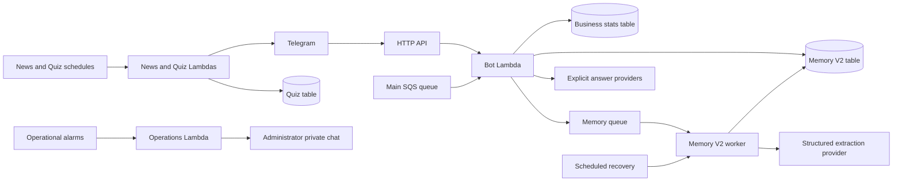

# ZerdeBot Architecture

The current system keeps Python, Lambda, SQS and DynamoDB. Memory V2 is the sole knowledge owner: facts come from a member's explicit self-statements in one group, have current evidence, and can be corrected or forgotten. Profiles are views of valid facts. Automatic replies, reactions, channel comments, historical imports and experimental contests are retired.

This source change removes the 13 legacy algorithm modules and their callers. It is not a claim that the new source has been deployed or that AWS resources have been destroyed. Read [TASKS](goals/zerdebot-memory-v2/TASKS.md), [HANDOFF](goals/zerdebot-memory-v2/HANDOFF.md) and [retirement inventory](goals/zerdebot-memory-v2/RETIREMENT_INVENTORY.md) for those separate states. The verified deployment before this cleanup is PR223 build c9a4219 / merge b232df6.

## Current runtime

| Package / entry | Responsibility |
|---|---|
| `src/bot/main.py` | Webhook and current main SQS work; lazy dependencies in `app.py` |
| `src/bot/memory_worker_main.py` | V2 extraction, recovery and lifecycle work; inspect current entry in CDK before deployment |
| `src/bot/vector_indexer_main.py` | Temporary discard-only consumer; no vector algorithms, embeddings or producer remain; delete with its dedicated AWS resources |
| `src/news/main.py` | News fetch and per-group delivery recovery |
| `src/quiz/main.py` | Daily/on-demand polls, durable publication and scoring recovery |
| `src/operations/main.py` | Deduplicated fault/recovery/budget messages to the configured private administrator |
| `src/shared/python/zerde_common` | Shared configuration, secrets, provider errors, redaction and logging layer |

## Telegram and explicit answers

The webhook checks its secret and configured group boundary before business processing. Pending captcha messages remain in captcha; spam enforcement and queued moderation short-circuit normal handling. CLEAN moderation admits the staged original source through V2 ingestion. A moderation task's copied text is not a new memory source.

Ordinary chatter may be learned in an explicitly enabled V2 group, but does not generate automatic social output. `/ask`, direct mentions and requested bot followups remain available independently of retired memory/agent flags. `/memory` has one V2 public-command owner. `/agent` explains retirement; it cannot enable old behavior. A quoted old bot answer is never used as fallback context.

`services/group_agent.py` owns explicit trigger/length policy and Gemini -> DeepSeek/Groq fallback. `services/explicit_context.py` owns pure text/caption/reference formatting and bounded style normalization, without database access. The default style is shared with the strict evaluation serializer. Empty historical context fields in that serializer are a preserved request contract, not readers of old profiles or vectors. No old SETTINGS are read; the reviewed retirement gate requires fresh complete field/hash verification before deploying this removal and before deleting the old tables.

Explicit media is temporary. `ExplicitContextRepository` directly delegates to V2 `EphemeralMediaRepository`; it does not inherit the deleted group-memory repository or require `MEMORY_TABLE_NAME`. Metadata-only album expansion, source revision/epoch/actor/TTL checks and final sending fences remain in their existing owners. Workers download media only for explicit requests under shared size limits. An explicit processing acknowledgement is not an ambient reaction. Media analysis is not automatically learned as a durable personal fact.

`ExplicitDelivery` and `explicit_request_gate` preserve source freshness, leases and ambiguous-send semantics across primary/fallback attempts and retries. Do not remove a guard because an older argument or receipt name contains `legacy`, `memory` or `retrieval`.

## V2 ownership and lifecycle

See [runtime contract](MEMORY_V2_RUNTIME.md), [public evaluation](MEMORY_PUBLIC_EVALUATION.md), [source retry contract](goals/zerdebot-memory-v2/SOURCE_RETRY_EXECUTION.md) and [quality follow-up](MEMORY_QUALITY_FOLLOWUP.md).

- Identity is `(chat_id, telegram_user_id)`; aliases do not merge people or groups.
- Message observation and durable pending work use the V2 owner. Queued work contains source references/versions and must reload current data.
- The unique writer validates complete evidence, identity, control epoch, deletion generation and logical expiry before committing facts. Structured extraction failure does not produce regex facts.
- Partial source retry validates the whole envelope, retains complete neighbors and retries only unresolved references within the original two-call limit. Source validation errors cannot become partial success.
- Explicit answer assertions require current evidence. Wrong/correct/forget/optout and edits invalidate derived content and pending work. Explicit cross-person ownership refusal is a durable DENIED outcome; transient storage uncertainty remains retryable.
- Raw retention and minimal fact evidence use the V2 contract; DynamoDB TTL performs eventual physical cleanup, not logical authorization.
- Existing budget reservation, AWS measurement coverage and UNKNOWN liability retain their sole owners. A point-in-time read-only PASS never authorizes future model calls by itself.

Only the existing dev pilot is enabled at the last verified release. Production has no learning CONTROL; budget rows in its V2 table do not imply learning activation. Natural acceptance remains separate from synthetic tests and elapsed calendar days.

## Current task routing

`services/sqs_task_router.py` handles captcha timeout/recovery, spam moderation, current-version explicit asks and Quiz answer/recovery tasks. Old memory/social/vector/contest schemas are rejected before chat lookup or business dependencies. The temporary vector consumer also discards those old envelopes. Keep this small rejection protocol until every ingress is proven unable to accept the old schemas; it cannot reactivate a deleted algorithm.

Memory V2 has its own queue/worker and recovery owner. Do not purge or receive from a mixed queue to infer emptiness, and do not manually invoke business work to manufacture acceptance evidence.

## Business owners and protection

Captcha uses generation/revision CAS, durable verification/rejection and a bounded lease longer than the Bot Lambda timeout. Persist decisions before Telegram effects; retain retryable uncertainty. See [captcha lifecycle](captcha-lifecycle.md).

Spam records actual enforcement outcomes; failed deletion/ban cannot be reported as confirmed success. Classification uses the current message/reply/quote; no legacy recent-chat reader remains. Voteban session identity and expiry belong to the vote repository. News and Quiz retain their existing delivery/publication/answer recovery protocols; synthetic passes do not substitute for remaining controlled real-path acceptance.

Preserve the six active tables: dev/prod business stats, Quiz and Memory V2. The two old bot-memory tables and dedicated vector resources still require separate deployment/physical retirement. The older stats/queue/log candidates need fresh consumer and identity checks. Shared assets/layer, active business queues, controls, budget and UNKNOWN records are protected.

Production Chinese news remains explicitly DISABLED in both template and live schedule; other languages retain their current settings. The retired daily group-summary schedule must never be recreated.

## Delivery and evidence

[FINISH_EXECUTION](goals/zerdebot-memory-v2/FINISH_EXECUTION.md) owns R1–R4 sequence. New feature/group/production-memory activation depends on completing the exact cleanup inventory. Announce delete/keep items before removal. Track local code, PR/merge, deployment, online data removal, physical resource absence and retained-copy expiry separately. CloudFormation Retain means detachment, not deletion.

Lock/export/build versions, actual ARM handler imports and actual downloaded ZIP contents must agree. The source-retirement package must contain none of the 13 removed modules or their bytecode. Preserve settings/control/budget and unchanged business configuration in before/after readback. Historical failed receipts remain immutable; do not replace them with later success.

The user Telegram exports are retained. PITR/log/DLQ/backup obligations remain under Z10 and the existing retention ledger; an absent table or online fact is not proof that all physical copies have vanished.
