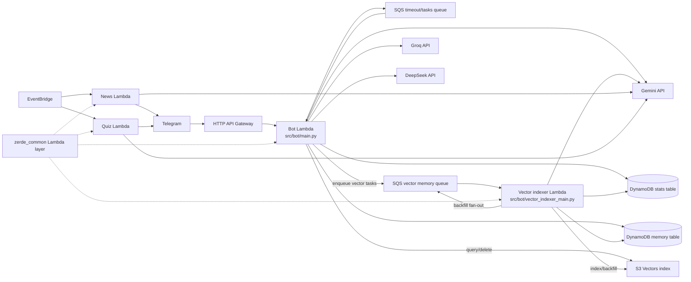

# ZerdeBot Architecture

This is the current developer-facing map of ZerdeBot. Keep it updated when changing memory, agent behavior, SQS task routing, DynamoDB schemas, vector retrieval, or CDK wiring.

## Product Direction

ZerdeBot is no longer a simple LLM wrapper. The bot is now a serverless Telegram group-chat agent:

- It observes opted-in group messages and stores recent context.
- It extracts long-term memories and daily summaries.
- It embeds long-term memory and high-information daily summaries into S3 Vectors for semantic retrieval.
- It answers explicit questions through a retrieval pipeline that combines requester identity, recent context, user profiles, long-term memory, and query-matched vector memory.
- It can continue reply threads with its own previous answers and the original quoted source message when that context was captured.
- It stores normal bot answers only as short-term reply-thread metadata, not as long-term semantic memory.
- It may proactively join a discussion, but only after a short delayed candidate window, local gating, human-answer checks, model timing judgment, recent-bot-activity penalty, and daily limits. Linked channel posts mirrored into discussion groups use a separate short discussion-starter path.

RAG is one part of the system. The larger system is an agentic bot: it decides whether to answer, what context to use, how long the answer should be, and what to remember afterward.

## Runtime Topology

## Lambda Packages

| Package | Entry | Main responsibilities |
|---------|-------|-----------------------|
| `src/bot/` | `main.py:lambda_handler` | API Gateway webhook and main SQS worker. Handles Telegram updates, captcha, voteban, spam checks, group memory, `/ask`, agent replies, semantic retrieval, and cleanup commands. |
| `src/bot/services/memory_retrieval.py` | `build_agent_memory_context` | Memory Retrieval Pipeline V1: query intent, raw candidate retrieval, local scoring/dedupe, candidate-driven prompt packing, and selected-source tracking. |
| `src/bot/` | `vector_indexer_main.py:lambda_handler` | Dedicated vector memory SQS worker for embedding/indexing and vector backfill paging. |
| `src/news/` | `main.py:lambda_handler` | Scheduled IT news digest and Telegram delivery. |
| `src/quiz/` | `main.py:lambda_handler` | Scheduled and on-demand multilingual developer quizzes. |
| `src/shared/python/zerde_common/` | Lambda layer | Shared env helpers, SSM batch secret loading, provider errors, JSON logging, redaction, Telegram update log truncation. |

## Bot Request Flow

1. `webhook.handle_event` verifies the Telegram webhook secret.
2. Private chats get a fixed response; non-whitelisted groups are ignored.
3. Spam screening runs before normal handling unless a captcha is pending.
4. `group_memory.observe_update` stores non-command group messages and queues long-term memory extraction.
5. If ambient reactions are enabled, eligible group text messages, including command text, are sampled and queued as `PROCESS_AMBIENT_REACTION`; classification runs asynchronously and does not use long-term memory or vector search.
6. Irrelevant group chatter exits early.
7. Relevant events route to the group agent or the command dispatcher.
8. `/ask` is queued as `PROCESS_GROUP_ASK` with requester metadata so Telegram webhook latency stays low and self-reference questions are grounded. When `/ask` explicitly replies to supported media, the webhook adds only a serializable `media_ref`; it does not download bytes.
9. `agent_enabled` gates non-command group agent participation: proactive candidates and linked-channel post discussion-starter candidates are delayed as `PROCESS_PROACTIVE_CANDIDATE`, while @mentions and reply-to-bot follow-ups stay immediate. Explicit `/ask` remains available while `memory_enabled` is true.

ZerdeBot does not automatically analyze every group media message. It analyzes media only when explicitly asked via `/ask` or an explicit mention/reply path. Media analysis is ephemeral and is not written into long-term memory or vector storage by default. Normal photos, voice messages, and documents are ignored for multimodal analysis, including proactive candidates, daily summaries, memory extraction, and vector indexing.

## SQS Tasks

The bot Lambda consumes real-time and group-memory tasks. The vector-indexer Lambda consumes slower embedding/backfill work from the vector queue:

| Task type | Queue | Handler |
|-----------|-------|---------|
| `CHECK_TIMEOUT` | timeout/tasks queue | Bot Lambda captcha timeout enforcement. |
| `SPAM_CHECK` | timeout/tasks queue | Bot Lambda Groq-based async spam classification. |
| `PROCESS_GROUP_ASK` | timeout/tasks queue | Bot Lambda async explicit agent answer with optional requester metadata and optional metadata-only `media_ref`. Media bytes are downloaded only in this worker. |
| `PROCESS_PROACTIVE_CANDIDATE` | timeout/tasks queue | Bot Lambda delayed proactive final check that re-reads recent context, stays silent if humans answered, then uses existing score/model/daily-limit gating. Linked-channel post candidates use a separate discussion-starter prompt instead of the open-question prompt. |
| `PROCESS_AMBIENT_REACTION` | timeout/tasks queue | Bot Lambda async classifier for sampled normal group text messages; may call `setMessageReaction` and stores only short-lived `AMBIENT_REACTION#...` metadata. |
| `PROCESS_GROUP_MEMORY` | timeout/tasks queue | Bot Lambda structured extraction of one long-term memory item from a stored group message, with rule fallback. |
| `PROCESS_DAILY_GROUP_SUMMARIES` | timeout/tasks queue | Bot Lambda daily summaries for configured groups. |
| `PROCESS_VECTOR_MEMORY` | vector memory queue | Vector-indexer Lambda embeds and indexes one memory item in S3 Vectors. |
| `PROCESS_VECTOR_MEMORY_BACKFILL` | vector memory queue | Vector-indexer Lambda pages through historical vectorizable memory items and enqueues indexing. |

Most task failures re-raise in `services/sqs_task_router.py` so SQS retry and DLQ semantics apply.
Ambient reaction classifier/API failures are logged and skipped because reactions must never disturb
normal bot processing. The main task queue defaults to 1 day of message retention, the vector-memory
queue defaults to 4 days, and both DLQs default to 14 days for incident inspection and redrive. CDK deploy-time env vars
`MAIN_TASK_QUEUE_RETENTION_DAYS`, `MAIN_TASK_DLQ_RETENTION_DAYS`,
`VECTOR_MEMORY_QUEUE_RETENTION_DAYS`, and `VECTOR_MEMORY_DLQ_RETENTION_DAYS` can tune these values
within SQS's 1-14 day range.

## DynamoDB Memory Table

The table is single-table by chat partition:

| Key pattern | Meaning |
|-------------|---------|
| `pk=CHAT#<chat_id>, sk=SETTINGS` | Per-chat `memory_enabled`, `agent_enabled`, and optional `style_profile` for agent reply tone/length/uncertainty behavior. |
| `sk=MSG#<created_at_ms>#<message_id>` | Recent raw group message for prompt context, including reply-to ids, sender metadata, bot/self-bot flags, and simple thread root metadata when available. |
| `sk=USER#<user_id>` | User profile derived only from that user's own messages. |
| `sk=USERNAME#<lower_username>` | Per-chat username alias that maps Telegram handles to `USER#<user_id>` without paging all profiles. |
| `sk=EVENT#...` | Time-bound event or operational memory. |
| `sk=USER_FACT#<user_id>#...` | User-stated preference, boundary, or recurring personal context. |
| `sk=GROUP_FACT#...` | Group decision or shared preference. |
| `sk=JOKE#...` | Possible recurring joke or meme. Stored only from high-confidence Gemini extraction or repeated evidence because jokes are easy to over-retrieve. |
| `sk=DAILY_SUMMARY#YYYY-MM-DD` | Daily compressed memory for imported or observed messages. |
| `sk=TERM#<term>#<created_at_ms>#<source_sk>` | Lightweight exact-term lexical index row pointing back to a long-term memory or daily summary source item. |
| `sk=AGENT_REPLY#<bot_message_id>` | Short-term bot answer metadata, answer text, triggering/current user message, optional quoted source-message context, optional compact media metadata/summary, parent bot message id, requester metadata, and compact retrieval source metadata, including deletion policy, for reply-thread continuity, `/agent why`, `/agent wrong`, `/memory wrong`, and `/memory forget this`. These rows are not long-term semantic memory. |
| `sk=AMBIENT_REACTION#<created_at_ms>#<message_id>` | Seven-day reaction metadata for cooldowns/debugging: chat id, user id, message id, emoji, category, confidence, and TTL. These rows are not semantic/vector memory. |
| `sk=BOT_COMMITMENT#...` | Reserved durable bot-authored commitment key family for a future explicit command/admin flow. Normal answer generation must not write this. |
| `sk=BOT_CORRECTION#...` | Reserved durable bot-authored correction key family for a future explicit user/admin correction flow. Normal answer generation must not write this. |
| `sk=VECTOR_BACKFILL` | Cumulative vector backfill status for a chat. Tracks `processed_total`, `enqueued_total`, `failures_total`, `started_at`, `last_updated_at`, optional `finished_at`, and continuation tokens. Legacy `vector_backfill_*` attributes are still written for compatibility. |
| `sk=PROACTIVE#YYYYMMDD` | Daily proactive reply reservation counter. |

Long-term memory items include `extractor_source`, `sensitivity`, `evidence_message_ids`, feedback metadata such as `wrong_feedback_count`, `negative_feedback_count`, `last_feedback_at`, `feedback_status`, a `superseded_by` placeholder for future consolidation, and optional `expires_at` metadata. Long-term memory prefixes are vectorizable, and daily summaries are vectorized only when they are high-information. Raw `MSG#...` items, normal bot answer `AGENT_REPLY#...` items, and `AMBIENT_REACTION#...` rows are not vector memory. The reserved `BOT_COMMITMENT#...` and `BOT_CORRECTION#...` families are placeholders for explicit future durable bot memory flows and are not vectorizable until such flows add review/permission checks and tests.

Memory retention is type-specific. `GROUP_MEMORY_RAW_MESSAGE_RETENTION_DAYS` controls raw `MSG#...` records, `GROUP_MEMORY_AGENT_REPLY_RETENTION_DAYS` controls `AGENT_REPLY#...` thread metadata, `GROUP_MEMORY_LONG_TERM_RETENTION_DAYS` controls `EVENT#...`, `USER_FACT#...`, `GROUP_FACT#...`, and `JOKE#...`, `GROUP_MEMORY_DAILY_SUMMARY_RETENTION_DAYS` controls `DAILY_SUMMARY#...`, and `GROUP_MEMORY_PROACTIVE_COUNTER_RETENTION_DAYS` controls `PROACTIVE#...` counters. `MSG#...`, long-term memory, and `DAILY_SUMMARY#...` retention settings fall back to `GROUP_MEMORY_RETENTION_DAYS` when omitted; `AGENT_REPLY#...` and `PROACTIVE#...` keep their existing short defaults unless explicitly configured. Long-term `expires_in_days` still stores `expires_at`; the DynamoDB `ttl` is the shorter of explicit expiry and configured long-term retention.

## Long-Term Memory Extraction

`services.group_memory_processor.process_group_memory_task` uses `services.memory_extractor` for one-message extraction. The default backend is `GROUP_MEMORY_EXTRACTOR_PROVIDER=gemini`, but production should keep `GROUP_MEMORY_EXTRACTOR_MODE=gemini_candidate_only`. In candidate-only mode, the worker first applies cheap local gates: rule-based memory cues, durable decision/preference/incident/joke/technical terms, reply or mention hints, and a deterministic small sample of long-form technical messages. Only candidate messages call Gemini for compact JSON matching the `ExtractedMemory` schema: `should_store`, `kind`, `summary`, `reason`, `confidence`, `subject_user_id`, `sensitivity`, `expires_in_days`, and `evidence_message_ids`.

Extractor modes are `rules`, `gemini_candidate_only`, and `gemini_all`. `gemini_all` preserves the original "try Gemini for every safe message" behavior, but it is still bounded by the extractor LLM budgets. `GROUP_MEMORY_EXTRACTOR_DAILY_LLM_LIMIT` (default `50`) and `GROUP_MEMORY_EXTRACTOR_PER_CHAT_DAILY_LIMIT` (default `20`) use independent DynamoDB rate-limit scopes before Gemini is called, so background memory extraction cannot consume the full shared Gemini generate RPD used by `/ask`, proactive decisions, and summaries.

The extractor stores only memories above `GROUP_MEMORY_EXTRACTOR_MIN_CONFIDENCE` (default `0.65`) and rejects `sensitive` or `secret` outputs. It also rejects third-party `user_fact` claims by requiring the extracted `subject_user_id` to match the speaker for personal memories. `JOKE#` storage is stricter than ordinary memory: a one-message rule fallback joke is not durable, while high-confidence Gemini joke extraction or repeated evidence can be stored. If Gemini is unavailable, quota-exhausted, unconfigured, not selected by candidate-only mode, or over the extractor budget, the existing cue-based classifier runs as the fallback. The same safety filters still block secrets, contact details, medical/financial/identity data, future-answer directives, subjective people rankings, and jokes-as-facts.

## Agent Answer Context

`services.group_agent.answer_group_question` calls `services.memory_retrieval.build_agent_memory_context`, which wraps the existing retrievers into Memory Retrieval Pipeline V1. The agent keeps the full `user_text` generation prompt for Gemini, but passes a separate compact `retrieval_query` into memory retrieval. For reply threads, that query keeps the current follow-up plus the relevant previous user/source context while avoiding the full previous bot answer unless no better thread context is available. The pipeline analyzes retrieval-query intent, retrieves raw profile, semantic, lexical, long-term, and recent candidates, scores/dedupes them locally, selects the top candidates within a character budget, renders prompt sections from those selected candidates, and returns compact `retrieval_sources` metadata for the sources that actually reached the prompt. Target-user profile lookup resolves `@username` mentions through `USERNAME#...` aliases before fetching `USER#<user_id>` directly.

The returned bundle still exposes separate prompt sections for Gemini, but their content is candidate-driven rather than copied wholesale from each retriever:

1. Trusted requester profile context for the user who asked the question.
2. Trusted target-user profile context, only for users explicitly mentioned in the user message.
3. Semantic memory context from S3 Vectors, query-matched by `retrieval_query`, optionally requester-filtered for self-reference, and optionally narrowed by memory kind for obvious query intent.
4. Long-term memory context filtered by `retrieval_query` terms and intent memory kinds, with exact-term lexical candidates from `TERM#...` DynamoDB index rows when useful and a bounded recent fallback for legacy unindexed items.
5. Recent group context with speaker metadata.
6. Reply-thread context when the user replies to Zerde's own previous answer, including the captured original quoted message, previous user request, previous bot answer, and current follow-up when available.

The local reranker treats requester profiles as highest trust for self-reference, target-user profiles above ordinary memory, user facts above daily summaries, and jokes as low priority unless the query explicitly asks for a joke or meme. Exact lexical matches boost codes, usernames, and technical terms such as `E1027`, `S3`, or `OpenSearch`; semantic distance, trust level, target-user match, recency, memory confidence, and wrong-source feedback are also considered. Obvious intents narrow memory kinds before ranking: self-reference and target-user questions search user facts, group decisions search group facts and daily summaries, past events search events and daily summaries, and joke/meme questions search jokes and daily summaries. Because selected candidates are what render prompt content, this ranking directly controls whether a semantic user fact, lexical exact match, daily summary, joke, old event, or recent message reaches Gemini. If a query has no usable relevance terms, lexical long-term memory is not injected into the answer path.

`/agent why` reads the latest or replied `AGENT_REPLY#...` item and shows trigger, reason, confidence, and only memory source types/counts such as requester profile, semantic memory, lexical memory, long-term group memory, and recent context. It intentionally does not print full memory text. Retrieval source metadata also records a deletion policy: only durable long-term source keys such as `EVENT#...`, `USER_FACT#...`, `GROUP_FACT#...`, `JOKE#...`, and allowed `DAILY_SUMMARY#...` items are deletable through a replied bot answer. Profile sources such as `USER#...`, raw `MSG#...`, and recent context are not bot-answer deletable sources.

Explicit multimodal `/ask` adds media as another current input to the same RAG answer path. The retrieval query is built from the user's question plus compact safe media metadata such as caption, file name, and source speaker; raw binary content, OCR output, and transcripts are not used for semantic retrieval or vector indexing. Supported first-version media includes Telegram photos, image documents, voice/audio, PDFs, and text/code/log files under the configured limits. Binary media is sent to Gemini as inline data when it is below `MULTIMODAL_INLINE_MAX_BYTES`; text/code/log files are decoded as bounded UTF-8 text up to `MULTIMODAL_TEXT_FILE_MAX_CHARS`.

`AGENT_REPLY#...` is deliberately short-term reply-thread continuity, not a durable claim that the bot should learn from itself. Normal answers are not sent through long-term memory extraction, are not listed by vector backfill, and are rejected by vector indexing if a bad task references them. Multimodal answers may store only compact media metadata and an answer-derived media summary in `AGENT_REPLY#...` so a follow-up like "what should I do next?" can continue the thread. They do not store raw media bytes, downloaded files, full transcripts/OCR, or media-derived long-term facts. If the bot later needs to remember its own explicit commitment, a user/admin correction, or durable media-derived memory, that should use a deliberate explicit command/admin flow such as `BOT_COMMITMENT#...` or `BOT_CORRECTION#...` rather than reusing ordinary answer metadata.

`/agent wrong` and `/memory wrong` can be used as a reply to a bot answer to mark its recorded memory sources as wrong. This increments negative feedback metadata on the source items and lowers their future retrieval priority; it does not delete memory immediately.

Memory safety filters apply before context reaches the model. Raw `MSG#...` items can remain in DynamoDB for audit/recent history, but messages that look like future-answer directives ("when someone asks X, answer Y"), self-promotion, or subjective people rankings ("best in the chat", "strongest developer", "ең мықты") are excluded from profile learning, long-term memory classification, daily summaries, vector indexing, recent prompt context, semantic prompt context, and lexical fallback context.

## Agent Timing And Length

`/agent off` disables proactive, mention, and reply-to-bot participation only. It does not disable explicit `/ask`; use `/memory off` when the group should stop memory-backed explicit answers too.

Proactive replies are conservative:

- The local prefilter only considers open questions or requests.
- Linked channel posts mirrored into discussion groups are detected from `is_automatic_forward` or the Telegram `777000` actor plus `sender_chat.type=channel`; these may pass a separate longer text limit and discussion-starter prompt without weakening the normal open-question prefilter.
- Candidates that pass the local prefilter are queued with `AGENT_PROACTIVE_DELAY_SECONDS` before final evaluation, so humans can answer first.
- The delayed task re-reads messages after the trigger and stays silent when a later human reply looks sufficient.
- Bot-behavior meta complaints and stop cues are ignored, but generic technical/product mentions of "bot"/"бот" are still allowed through scoring.
- The reply score recognizes multilingual technical, suggestion, and group-request cues in Kazakh, Russian, English, and Chinese.
- Local prefilter skips for open-question candidates are logged with a structured skip reason before score/model gating.
- Recent bot activity lowers the score.
- Gemini must return a strong "should reply" decision.
- `AGENT_DAILY_PROACTIVE_LIMIT` caps per-chat daily proactive responses.

Answer length is explicit:

- Reply-to-Zerde follow-ups get a short budget.
- Reply-to-Zerde follow-ups must pass a conservative local gate; clear questions or requests continue the thread, while pure reactions, thanks, laughter, and short comments stay silent. Replies to other bots are not treated as Zerde reply threads unless the user explicitly mentions Zerde.
- Plain `/ask` explanations get a medium budget.
- Detailed answers require explicit cues such as "подробно", "толық", or "deep dive".
- Per-chat `style_profile` settings can tune `tone`, `max_default_sentences`, `max_proactive_sentences`, `allow_light_humor`, and `low_confidence_behavior`; defaults keep concise answers and proactive replies short.
- When selected semantic or lexical memory is low confidence or weakly matched, default `low_confidence_behavior=cautious` adds uncertainty instructions so the model does not present shaky memory as fact.
- `fit_llm_output` trims overly long responses before Telegram HTML normalization.
- Gemini `200 OK` responses with no candidate text are logged with safe response-shape metadata and treated as non-retryable for interactive `/ask` SQS work; the user gets the normal unavailable notice instead of a noisy retry loop.

## Ambient Reactions

Ambient reactions are a presence feature controlled by `AMBIENT_REACTIONS_ENABLED`, enabled by default.
The webhook samples eligible group text messages and queues `PROCESS_AMBIENT_REACTION`; the SQS
worker applies cooldowns, gathers limited recent context, asks the ambient classifier provider chain
(Gemini → DeepSeek → Groq when configured) for strict JSON, validates the emoji/confidence contract,
and calls Telegram `setMessageReaction`. Reaction failures are logged and do not affect normal
message handling.

The classifier receives only recent short-term context: up to 10 previous stored `MSG#...` text rows,
the current message, and for replies a bounded reply chain from the Telegram update payload
(`MAX_REPLY_CHAIN_DEPTH=3`, `MAX_CONTEXT_MESSAGES_TOTAL=15`). It does not use long-term memory, S3
Vectors, media download/analysis, profile context, or memory retrieval. The only stored output is
short-lived `AMBIENT_REACTION#...` metadata for cooldowns and debugging.
Command text and sensitive/hostile/serious text are not locally filtered before classification; the
LLM prompt still requires a strong, context-safe reaction and forbids reactions that trivialize, mock,
endorse, or escalate harm.
Linked channel posts mirrored into discussion groups are eligible as text messages; their actor is the
source `sender_chat` channel rather than Telegram's synthetic `777000` user, so reaction cooldowns and
prompt speaker metadata are scoped to the channel identity.

## Vector Memory

S3 Vectors is used for semantic retrieval over trusted long-term memory:

- Embedding model: `VECTOR_MEMORY_EMBEDDING_MODEL` (default `gemini-embedding-2`).
- Embedding API calls use a shared DynamoDB RPD counter scoped as `gemini_embedding`; configure it with `GEMINI_EMBEDDING_RPD_LIMIT` (default `1000`).
- Dimensions: `VECTOR_MEMORY_DIMENSIONS` (default `768`).
- Schema version: `VECTOR_MEMORY_SCHEMA_VERSION` (default `1`) identifies the rendered embedding document schema for migrations.
- Provider: `VECTOR_MEMORY_PROVIDER=s3_vectors`.
- Retrieval distance cutoff: `VECTOR_MEMORY_MAX_DISTANCE` (default `0.85`) filters out distant vector matches before prompt injection.
- Vectorizable items: `EVENT#`, `USER_FACT#`, `GROUP_FACT#`, `JOKE#`, `DAILY_SUMMARY#`. `AGENT_REPLY#` is excluded so normal bot answers do not become semantic memory by accident.
- Successful indexing stores `vector_document_hash`, `vector_schema_version`, `vector_embedding_model`, and `vector_dimensions` on the DynamoDB memory item. Duplicate SQS deliveries skip embedding when all four values still match the current rendered document and config; changed text, model, dimensions, or schema version re-indexes the item.
- Live `DAILY_SUMMARY#...` items are stored in DynamoDB but are not vectorized when they come from fallback summary paths (`fallback_rpd`, `fallback_unavailable`, `fallback_no_gemini`) or when Gemini returns no topics, notable events, or inside jokes. This keeps generic "observed N messages" summaries out of semantic retrieval.
- Cleanup commands should delete both DynamoDB memory and associated vector keys when available. `/memory about me` shows only the current user's profile derived from their own messages. `/memory forget me` removes that user's profile, raw messages, user facts, and matching daily summaries. `/memory forget this` can be used as a reply to a bot answer to delete only durable recorded retrieval-source memory, or as a reply to a source message to delete the stored raw `MSG#...` item and long-term memory derived from that message. Bot-answer cleanup must not delete `USER#` profiles, raw `MSG#...` items, or recent context. `/agent wrong` and `/memory wrong` mark a replied bot answer's recorded memory sources as wrong without deleting them. Regular users can delete only durable memory tied to their own messages; the group owner or bot owner can delete group durable memory.
- Runtime IAM must include `s3vectors:GetVectors` together with `s3vectors:QueryVectors` because retrieval uses metadata filters and asks S3 Vectors to return metadata. Bot Lambda has query/get/delete/get-index permissions for retrieval and cleanup; `s3vectors:PutVectors` and `s3vectors:ListVectors` are limited to the vector-indexer Lambda.
- Retrieval, S3 query, context injection, and indexing success paths emit INFO logs with safe operational fields such as counts, filters, distance cutoffs, and vector dimensions.
- Vector indexing runs in the dedicated vector-indexer Lambda, with its own log group and Lambda alarms. The bot Lambda can still query/delete vectors for retrieval and memory cleanup, but it no longer consumes the vector memory queue.
- Vector backfill is page-based internally but records cumulative progress on the `VECTOR_BACKFILL` memory item. `/memory status` can show total processed, enqueued, and failed items across pages, plus timestamps for start, last update, and completion.

When vector indexing is incomplete, the agent still works with recent context, query-filtered DynamoDB long-term memory, and exact-term lexical lookup over `TERM#...` rows for vectorizable long-term memory items and daily summaries. The lexical path does not scan raw `MSG#...` items and only falls back to a bounded recent candidate set for older unindexed rows. Do not assume vector backfill will fix prompt pollution by itself. Vector retrieval uses metadata filters where available, including requester user filters for self-reference questions.

## Important Operational Notes

- Telegram BotFather privacy mode must be disabled, or the bot must be admin, to see full group context.
- Production uses SSM Parameter Store under `/zerde/<env>/...` for runtime secrets.
- `.env` is deploy-time CDK input for non-secret config and local/test execution.
- Do not log full prompts, full model responses, API keys, Telegram files, or user secrets.
- For production memory cleanup, first export the target DynamoDB items and vector keys to a local backup file, then delete narrowly.
- Main task queue retention defaults to 1 day, vector-memory queue retention defaults to 4 days, and both DLQs default to 14 days so failed async memory work can be inspected and redriven after temporary provider/API outages.
- Historical plan documents under `docs/superpowers/` are snapshots. Do not treat them as current architecture.

## Documentation Maintenance

When making a large architecture, memory, agent, queue, or infra change, update all of these in the same PR:

- `.codex/skills/zerdebot-development/SKILL.md`
- `.codex/AGENTS.md`
- `docs/ARCHITECTURE.md`
- `README.md`, `docs/README_kk.md`, and `docs/README_ru.md` when user-visible behavior changes
- `docs/LOCAL_TESTING.md` when env vars, deployment, queues, or setup steps change
- `docs/telegram_history_import.md` when memory import or vector indexing behavior changes
