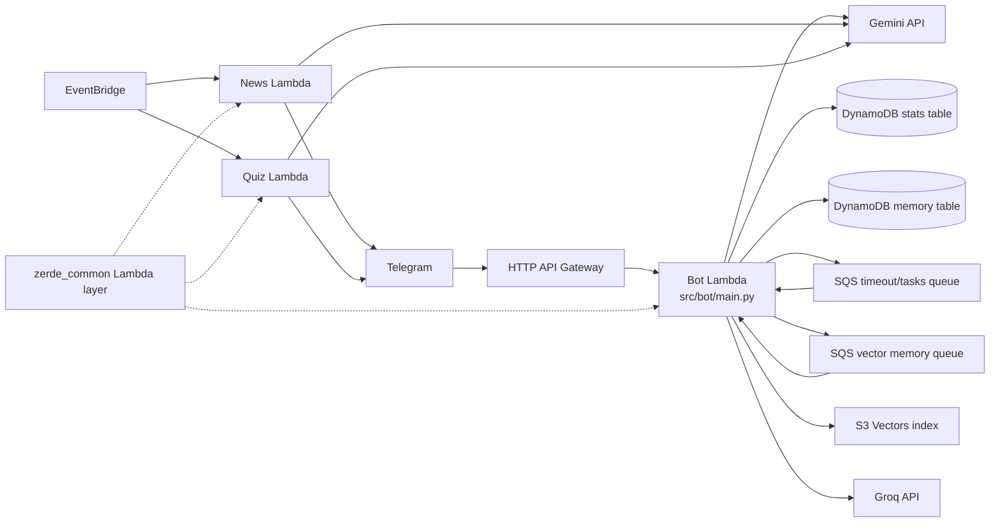

# ZerdeBot Architecture

This is the current developer-facing map of ZerdeBot. Keep it updated when changing memory, agent behavior, SQS task routing, DynamoDB schemas, vector retrieval, or CDK wiring.

## Product Direction

ZerdeBot is no longer a simple LLM wrapper. The bot is now a serverless Telegram group-chat agent:

- It observes opted-in group messages and stores recent context.
- It extracts long-term memories and daily summaries.
- It embeds long-term memory into S3 Vectors for semantic retrieval.
- It answers explicit questions with requester identity, recent context, user profiles, long-term memory, and query-matched vector memory.
- It can continue reply threads with its own previous answers and the original quoted source message when that context was captured.
- It may proactively join a discussion, but only after local gating, model timing judgment, recent-bot-activity penalty, and daily limits.

RAG is one part of the system. The larger system is an agentic bot: it decides whether to answer, what context to use, how long the answer should be, and what to remember afterward.

## Runtime Topology

## Lambda Packages

| Package | Entry | Main responsibilities |
|---------|-------|-----------------------|
| `src/bot/` | `main.py:lambda_handler` | API Gateway webhook and SQS worker in one Lambda. Handles Telegram updates, captcha, voteban, spam checks, group memory, `/ask`, agent replies, vector indexing, and cleanup commands. |
| `src/news/` | `main.py:lambda_handler` | Scheduled IT news digest and Telegram delivery. |
| `src/quiz/` | `main.py:lambda_handler` | Scheduled and on-demand multilingual developer quizzes. |
| `src/shared/python/zerde_common/` | Lambda layer | Shared env helpers, SSM batch secret loading, provider errors, JSON logging, redaction, Telegram update log truncation. |

## Bot Request Flow

1. `webhook.handle_event` verifies the Telegram webhook secret.
2. Private chats get a fixed response; non-whitelisted groups are ignored.
3. Spam screening runs before normal handling unless a captcha is pending.
4. `group_memory.observe_update` stores non-command group messages and queues long-term memory extraction.
5. Irrelevant group chatter exits early.
6. Relevant events route to the group agent or the command dispatcher.
7. `/ask` is queued as `PROCESS_GROUP_ASK` with requester metadata so Telegram webhook latency stays low and self-reference questions are grounded.

## SQS Tasks

The bot Lambda consumes both real-time and slower background tasks:

| Task type | Queue | Handler |
|-----------|-------|---------|
| `CHECK_TIMEOUT` | timeout/tasks queue | Captcha timeout enforcement. |
| `SPAM_CHECK` | timeout/tasks queue | Groq-based async spam classification. |
| `PROCESS_GROUP_ASK` | timeout/tasks queue | Async explicit agent answer with optional requester metadata. |
| `PROCESS_GROUP_MEMORY` | timeout/tasks queue | Extract one long-term memory item from a stored group message. |
| `PROCESS_DAILY_GROUP_SUMMARIES` | timeout/tasks queue | Build daily summaries for configured groups. |
| `PROCESS_VECTOR_MEMORY` | vector memory queue | Embed and index one memory item in S3 Vectors. |
| `PROCESS_VECTOR_MEMORY_BACKFILL` | vector memory queue | Page through historical vectorizable memory items and enqueue indexing. |

Failures re-raise in `services/sqs_task_router.py` so SQS retry and DLQ semantics apply.

## DynamoDB Memory Table

The table is single-table by chat partition:

| Key pattern | Meaning |
|-------------|---------|
| `pk=CHAT#<chat_id>, sk=SETTINGS` | Per-chat `memory_enabled` and `agent_enabled`. |
| `sk=MSG#<created_at_ms>#<message_id>` | Recent raw group message for prompt context. |
| `sk=USER#<user_id>` | User profile derived only from that user's own messages. |
| `sk=EVENT#...` | Time-bound event or operational memory. |
| `sk=USER_FACT#<user_id>#...` | User-stated preference or recurring personal context. |
| `sk=GROUP_FACT#...` | Group decision or shared preference. |
| `sk=JOKE#...` | Possible recurring joke or meme. Use carefully; this is easy to over-retrieve. |
| `sk=DAILY_SUMMARY#YYYY-MM-DD` | Daily compressed memory for imported or observed messages. |
| `sk=AGENT_REPLY#<bot_message_id>` | Bot answer metadata, answer text, triggering/current user message, optional quoted source-message context, parent bot message id, and requester metadata for reply-thread continuity. |
| `sk=VECTOR_BACKFILL` | Last vector backfill status for a chat. |
| `sk=PROACTIVE#YYYYMMDD` | Daily proactive reply reservation counter. |

Only long-term memory prefixes and daily summaries are vectorizable. Raw `MSG#...` items are prompt context, not vector memory.

## Agent Answer Context

`services.group_agent.answer_group_question` builds these sections:

1. Trusted requester profile context for the user who asked the question.
2. Trusted target-user profile context, only for users explicitly mentioned in the user message.
3. Semantic memory context from S3 Vectors, query-matched by current user text and optionally requester-filtered for self-reference.
4. Long-term memory context filtered by current query terms.
5. Recent group context with speaker metadata.
6. Reply-thread context when the user replies to the bot's previous answer, including the captured original quoted message, previous user request, previous bot answer, and current follow-up when available.

The Gemini prompt instructs the model to treat requester profiles as highest trust for self-reference, target-user profiles as higher trust than third-party chatter, semantic memory as lower trust than profiles, and to avoid turning one-off jokes into permanent facts. If a query has no usable relevance terms, lexical long-term memory is not injected into the answer path.

Memory safety filters apply before context reaches the model. Raw `MSG#...` items can remain in DynamoDB for audit/recent history, but messages that look like future-answer directives ("when someone asks X, answer Y"), self-promotion, or subjective people rankings ("best in the chat", "strongest developer", "ең мықты") are excluded from profile learning, long-term memory classification, daily summaries, vector indexing, recent prompt context, and semantic prompt context.

## Agent Timing And Length

Proactive replies are conservative:

- The local prefilter only considers open questions or requests.
- Bot-meta complaints and stop cues are ignored.
- Recent bot activity lowers the score.
- Gemini must return a strong "should reply" decision.
- `AGENT_DAILY_PROACTIVE_LIMIT` caps per-chat daily proactive responses.

Answer length is explicit:

- Reply-to-bot follow-ups get a short budget.
- Reply-to-bot follow-ups must pass a conservative local gate; clear questions or requests continue the thread, while pure reactions, thanks, laughter, and short comments stay silent.
- Plain `/ask` explanations get a medium budget.
- Detailed answers require explicit cues such as "подробно", "толық", or "deep dive".
- `fit_llm_output` trims overly long responses before Telegram HTML normalization.

## Vector Memory

S3 Vectors is used for semantic retrieval over trusted long-term memory:

- Embedding model: `VECTOR_MEMORY_EMBEDDING_MODEL` (default `gemini-embedding-2`).
- Dimensions: `VECTOR_MEMORY_DIMENSIONS` (default `768`).
- Provider: `VECTOR_MEMORY_PROVIDER=s3_vectors`.
- Retrieval distance cutoff: `VECTOR_MEMORY_MAX_DISTANCE` (default `0.85`) filters out distant vector matches before prompt injection.
- Vectorizable items: `EVENT#`, `USER_FACT#`, `GROUP_FACT#`, `JOKE#`, `DAILY_SUMMARY#`.
- Cleanup commands should delete both DynamoDB memory and associated vector keys when available. `/memory forget me` also removes daily summaries that mention the forgotten user's stored display name or username.
- Runtime IAM must include `s3vectors:GetVectors` together with `s3vectors:QueryVectors` because retrieval uses metadata filters and asks S3 Vectors to return metadata.
- Retrieval, S3 query, context injection, and indexing success paths emit INFO logs with safe operational fields such as counts, filters, distance cutoffs, and vector dimensions.

When vector indexing is incomplete, the agent still works with recent context and query-filtered DynamoDB long-term memory. Do not assume vector backfill will fix prompt pollution by itself. Vector retrieval uses metadata filters where available, including requester user filters for self-reference questions.

## Important Operational Notes

- Telegram BotFather privacy mode must be disabled, or the bot must be admin, to see full group context.
- Production uses SSM Parameter Store under `/zerde/<env>/...` for runtime secrets.
- `.env` is deploy-time CDK input for non-secret config and local/test execution.
- Do not log full prompts, full model responses, API keys, Telegram files, or user secrets.
- For production memory cleanup, first export the target DynamoDB items and vector keys to a local backup file, then delete narrowly.
- Main task DLQ retention is 4 days and vector-memory DLQ retention is 14 days so failed async memory work can be inspected and redriven.
- Historical plan documents under `docs/superpowers/` are snapshots. Do not treat them as current architecture.

## Documentation Maintenance

When making a large architecture, memory, agent, queue, or infra change, update all of these in the same PR:

- `.codex/skills/zerdebot-development/SKILL.md`
- `.codex/AGENTS.md`
- `docs/ARCHITECTURE.md`
- `README.md`, `docs/README_kk.md`, and `docs/README_ru.md` when user-visible behavior changes
- `docs/LOCAL_TESTING.md` when env vars, deployment, queues, or setup steps change
- `docs/telegram_history_import.md` when memory import or vector indexing behavior changes
