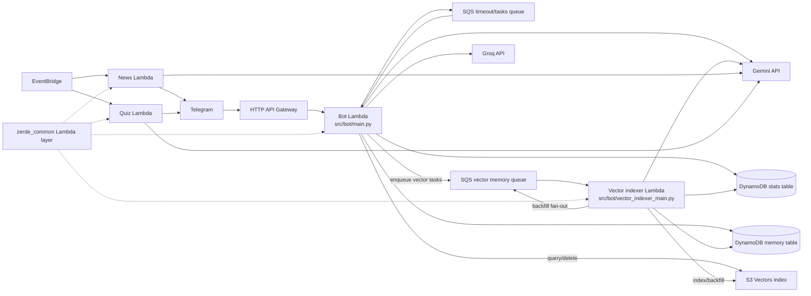

# ZerdeBot Architecture

This is the current developer-facing map of ZerdeBot. Keep it updated when changing memory, agent behavior, SQS task routing, DynamoDB schemas, vector retrieval, or CDK wiring.

## Product Direction

ZerdeBot is no longer a simple LLM wrapper. The bot is now a serverless Telegram group-chat agent:

- It observes opted-in group messages and stores recent context.
- It extracts long-term memories and daily summaries.
- It embeds long-term memory and high-information daily summaries into S3 Vectors for semantic retrieval.
- It answers explicit questions through a retrieval pipeline that combines requester identity, recent context, user profiles, long-term memory, and query-matched vector memory.
- It can continue reply threads with its own previous answers and the original quoted source message when that context was captured.
- It may proactively join a discussion, but only after local gating, model timing judgment, recent-bot-activity penalty, and daily limits.

RAG is one part of the system. The larger system is an agentic bot: it decides whether to answer, what context to use, how long the answer should be, and what to remember afterward.

## Runtime Topology

## Lambda Packages

| Package | Entry | Main responsibilities |
|---------|-------|-----------------------|
| `src/bot/` | `main.py:lambda_handler` | API Gateway webhook and main SQS worker. Handles Telegram updates, captcha, voteban, spam checks, group memory, `/ask`, agent replies, semantic retrieval, and cleanup commands. |
| `src/bot/services/memory_retrieval.py` | `build_agent_memory_context` | Memory Retrieval Pipeline V1: query intent, raw candidate retrieval, local scoring/dedupe, candidate-driven prompt packing, and selected-source tracking. |
| `src/bot/` | `vector_indexer_main.py:lambda_handler` | Dedicated vector memory SQS worker for embedding/indexing and vector backfill paging. |
| `src/news/` | `main.py:lambda_handler` | Scheduled IT news digest and Telegram delivery. |
| `src/quiz/` | `main.py:lambda_handler` | Scheduled and on-demand multilingual developer quizzes. |
| `src/shared/python/zerde_common/` | Lambda layer | Shared env helpers, SSM batch secret loading, provider errors, JSON logging, redaction, Telegram update log truncation. |

## Bot Request Flow

1. `webhook.handle_event` verifies the Telegram webhook secret.
2. Private chats get a fixed response; non-whitelisted groups are ignored.
3. Spam screening runs before normal handling unless a captcha is pending.
4. `group_memory.observe_update` stores non-command group messages and queues long-term memory extraction.
5. Irrelevant group chatter exits early.
6. Relevant events route to the group agent or the command dispatcher.
7. `/ask` is queued as `PROCESS_GROUP_ASK` with requester metadata so Telegram webhook latency stays low and self-reference questions are grounded.
8. `agent_enabled` gates non-command group agent participation: proactive replies, @mentions, and reply-to-bot follow-ups. Explicit `/ask` remains available while `memory_enabled` is true.

## SQS Tasks

The bot Lambda consumes real-time and group-memory tasks. The vector-indexer Lambda consumes slower embedding/backfill work from the vector queue:

| Task type | Queue | Handler |
|-----------|-------|---------|
| `CHECK_TIMEOUT` | timeout/tasks queue | Bot Lambda captcha timeout enforcement. |
| `SPAM_CHECK` | timeout/tasks queue | Bot Lambda Groq-based async spam classification. |
| `PROCESS_GROUP_ASK` | timeout/tasks queue | Bot Lambda async explicit agent answer with optional requester metadata. |
| `PROCESS_GROUP_MEMORY` | timeout/tasks queue | Bot Lambda structured extraction of one long-term memory item from a stored group message, with rule fallback. |
| `PROCESS_DAILY_GROUP_SUMMARIES` | timeout/tasks queue | Bot Lambda daily summaries for configured groups. |
| `PROCESS_VECTOR_MEMORY` | vector memory queue | Vector-indexer Lambda embeds and indexes one memory item in S3 Vectors. |
| `PROCESS_VECTOR_MEMORY_BACKFILL` | vector memory queue | Vector-indexer Lambda pages through historical vectorizable memory items and enqueues indexing. |

Failures re-raise in `services/sqs_task_router.py` so SQS retry and DLQ semantics apply.

## DynamoDB Memory Table

The table is single-table by chat partition:

| Key pattern | Meaning |
|-------------|---------|
| `pk=CHAT#<chat_id>, sk=SETTINGS` | Per-chat `memory_enabled` and `agent_enabled`. |
| `sk=MSG#<created_at_ms>#<message_id>` | Recent raw group message for prompt context. |
| `sk=USER#<user_id>` | User profile derived only from that user's own messages. |
| `sk=EVENT#...` | Time-bound event or operational memory. |
| `sk=USER_FACT#<user_id>#...` | User-stated preference, boundary, or recurring personal context. |
| `sk=GROUP_FACT#...` | Group decision or shared preference. |
| `sk=JOKE#...` | Possible recurring joke or meme. Use carefully; this is easy to over-retrieve. |
| `sk=DAILY_SUMMARY#YYYY-MM-DD` | Daily compressed memory for imported or observed messages. |
| `sk=AGENT_REPLY#<bot_message_id>` | Bot answer metadata, answer text, triggering/current user message, optional quoted source-message context, parent bot message id, requester metadata, and compact retrieval source metadata for reply-thread continuity, `/agent why`, and `/memory forget this`. |
| `sk=VECTOR_BACKFILL` | Last vector backfill status for a chat. |
| `sk=PROACTIVE#YYYYMMDD` | Daily proactive reply reservation counter. |

Long-term memory items include `extractor_source`, `sensitivity`, `evidence_message_ids`, and optional `expires_at` metadata. Long-term memory prefixes are vectorizable, and daily summaries are vectorized only when they are high-information. Raw `MSG#...` items are prompt context, not vector memory.

## Long-Term Memory Extraction

`services.group_memory_processor.process_group_memory_task` uses `services.memory_extractor` for one-message extraction. The default backend is `GROUP_MEMORY_EXTRACTOR_PROVIDER=gemini`, but production should keep `GROUP_MEMORY_EXTRACTOR_MODE=gemini_candidate_only`. In candidate-only mode, the worker first applies cheap local gates: rule-based memory cues, durable decision/preference/incident/joke/technical terms, reply or mention hints, and a deterministic small sample of long-form technical messages. Only candidate messages call Gemini for compact JSON matching the `ExtractedMemory` schema: `should_store`, `kind`, `summary`, `reason`, `confidence`, `subject_user_id`, `sensitivity`, `expires_in_days`, and `evidence_message_ids`.

Extractor modes are `rules`, `gemini_candidate_only`, and `gemini_all`. `gemini_all` preserves the original "try Gemini for every safe message" behavior, but it is still bounded by the extractor LLM budgets. `GROUP_MEMORY_EXTRACTOR_DAILY_LLM_LIMIT` (default `50`) and `GROUP_MEMORY_EXTRACTOR_PER_CHAT_DAILY_LIMIT` (default `20`) use independent DynamoDB rate-limit scopes before Gemini is called, so background memory extraction cannot consume the full shared Gemini generate RPD used by `/ask`, proactive decisions, and summaries.

The extractor stores only memories above `GROUP_MEMORY_EXTRACTOR_MIN_CONFIDENCE` (default `0.65`) and rejects `sensitive` or `secret` outputs. It also rejects third-party `user_fact` claims by requiring the extracted `subject_user_id` to match the speaker for personal memories. If Gemini is unavailable, quota-exhausted, unconfigured, not selected by candidate-only mode, or over the extractor budget, the existing cue-based classifier runs as the fallback. The same safety filters still block secrets, contact details, medical/financial/identity data, future-answer directives, subjective people rankings, and jokes-as-facts.

## Agent Answer Context

`services.group_agent.answer_group_question` calls `services.memory_retrieval.build_agent_memory_context`, which wraps the existing retrievers into Memory Retrieval Pipeline V1. The pipeline analyzes query intent, retrieves raw profile, semantic, lexical, long-term, and recent candidates, scores/dedupes them locally, selects the top candidates within a character budget, renders prompt sections from those selected candidates, and returns compact `retrieval_sources` metadata for the sources that actually reached the prompt.

The returned bundle still exposes separate prompt sections for Gemini, but their content is candidate-driven rather than copied wholesale from each retriever:

1. Trusted requester profile context for the user who asked the question.
2. Trusted target-user profile context, only for users explicitly mentioned in the user message.
3. Semantic memory context from S3 Vectors, query-matched by current user text and optionally requester-filtered for self-reference.
4. Long-term memory context filtered by current query terms, with exact-term lexical fallback candidates from DynamoDB when useful.
5. Recent group context with speaker metadata.
6. Reply-thread context when the user replies to the bot's previous answer, including the captured original quoted message, previous user request, previous bot answer, and current follow-up when available.

The local reranker treats requester profiles as highest trust for self-reference, target-user profiles above ordinary memory, user facts above daily summaries, and jokes as low priority unless the query explicitly asks for a joke or meme. Exact lexical matches boost codes, usernames, and technical terms such as `E1027`, `S3`, or `OpenSearch`; semantic distance, trust level, target-user match, recency, and memory confidence are also considered. Because selected candidates are what render prompt content, this ranking directly controls whether a semantic user fact, lexical exact match, daily summary, joke, old event, or recent message reaches Gemini. If a query has no usable relevance terms, lexical long-term memory is not injected into the answer path.

`/agent why` reads the latest or replied `AGENT_REPLY#...` item and shows trigger, reason, confidence, and only memory source types/counts such as requester profile, semantic memory, lexical memory, long-term group memory, and recent context. It intentionally does not print full memory text.

Memory safety filters apply before context reaches the model. Raw `MSG#...` items can remain in DynamoDB for audit/recent history, but messages that look like future-answer directives ("when someone asks X, answer Y"), self-promotion, or subjective people rankings ("best in the chat", "strongest developer", "ең мықты") are excluded from profile learning, long-term memory classification, daily summaries, vector indexing, recent prompt context, semantic prompt context, and lexical fallback context.

## Agent Timing And Length

`/agent off` disables proactive, mention, and reply-to-bot participation only. It does not disable explicit `/ask`; use `/memory off` when the group should stop memory-backed explicit answers too.

Proactive replies are conservative:

- The local prefilter only considers open questions or requests.
- Bot-behavior meta complaints and stop cues are ignored, but generic technical/product mentions of "bot"/"бот" are still allowed through scoring.
- The reply score recognizes multilingual technical, suggestion, and group-request cues in Kazakh, Russian, English, and Chinese.
- Local prefilter skips for open-question candidates are logged with a structured skip reason before score/model gating.
- Recent bot activity lowers the score.
- Gemini must return a strong "should reply" decision.
- `AGENT_DAILY_PROACTIVE_LIMIT` caps per-chat daily proactive responses.

Answer length is explicit:

- Reply-to-bot follow-ups get a short budget.
- Reply-to-bot follow-ups must pass a conservative local gate; clear questions or requests continue the thread, while pure reactions, thanks, laughter, and short comments stay silent.
- Plain `/ask` explanations get a medium budget.
- Detailed answers require explicit cues such as "подробно", "толық", or "deep dive".
- `fit_llm_output` trims overly long responses before Telegram HTML normalization.
- Gemini `200 OK` responses with no candidate text are logged with safe response-shape metadata and treated as non-retryable for interactive `/ask` SQS work; the user gets the normal unavailable notice instead of a noisy retry loop.

## Vector Memory

S3 Vectors is used for semantic retrieval over trusted long-term memory:

- Embedding model: `VECTOR_MEMORY_EMBEDDING_MODEL` (default `gemini-embedding-2`).
- Embedding API calls use a shared DynamoDB RPD counter scoped as `gemini_embedding`; configure it with `GEMINI_EMBEDDING_RPD_LIMIT` (default `1000`).
- Dimensions: `VECTOR_MEMORY_DIMENSIONS` (default `768`).
- Provider: `VECTOR_MEMORY_PROVIDER=s3_vectors`.
- Retrieval distance cutoff: `VECTOR_MEMORY_MAX_DISTANCE` (default `0.85`) filters out distant vector matches before prompt injection.
- Vectorizable items: `EVENT#`, `USER_FACT#`, `GROUP_FACT#`, `JOKE#`, `DAILY_SUMMARY#`.
- Live `DAILY_SUMMARY#...` items are stored in DynamoDB but are not vectorized when they come from fallback summary paths (`fallback_rpd`, `fallback_unavailable`, `fallback_no_gemini`) or when Gemini returns no topics, notable events, or inside jokes. This keeps generic "observed N messages" summaries out of semantic retrieval.
- Cleanup commands should delete both DynamoDB memory and associated vector keys when available. `/memory about me` shows only the current user's profile derived from their own messages. `/memory forget me` removes that user's profile, raw messages, user facts, and matching daily summaries. `/memory forget this` can be used as a reply to a bot answer to delete recorded retrieval-source memory, or as a reply to a source message to delete the stored raw `MSG#...` item and long-term memory derived from that message. Regular users can delete only memory tied to their own messages; the group owner or bot owner can delete group memory.
- Runtime IAM must include `s3vectors:GetVectors` together with `s3vectors:QueryVectors` because retrieval uses metadata filters and asks S3 Vectors to return metadata. Bot Lambda has query/get/delete/get-index permissions for retrieval and cleanup; `s3vectors:PutVectors` and `s3vectors:ListVectors` are limited to the vector-indexer Lambda.
- Retrieval, S3 query, context injection, and indexing success paths emit INFO logs with safe operational fields such as counts, filters, distance cutoffs, and vector dimensions.
- Vector indexing runs in the dedicated vector-indexer Lambda, with its own log group and Lambda alarms. The bot Lambda can still query/delete vectors for retrieval and memory cleanup, but it no longer consumes the vector memory queue.

When vector indexing is incomplete, the agent still works with recent context, query-filtered DynamoDB long-term memory, and prefix-specific lexical fallback over vectorizable long-term memory items. The lexical fallback does not scan raw `MSG#...` items. Do not assume vector backfill will fix prompt pollution by itself. Vector retrieval uses metadata filters where available, including requester user filters for self-reference questions.

## Important Operational Notes

- Telegram BotFather privacy mode must be disabled, or the bot must be admin, to see full group context.
- Production uses SSM Parameter Store under `/zerde/<env>/...` for runtime secrets.
- `.env` is deploy-time CDK input for non-secret config and local/test execution.
- Do not log full prompts, full model responses, API keys, Telegram files, or user secrets.
- For production memory cleanup, first export the target DynamoDB items and vector keys to a local backup file, then delete narrowly.
- Main task DLQ retention is 4 days and vector-memory DLQ retention is 14 days so failed async memory work can be inspected and redriven.
- Historical plan documents under `docs/superpowers/` are snapshots. Do not treat them as current architecture.

## Documentation Maintenance

When making a large architecture, memory, agent, queue, or infra change, update all of these in the same PR:

- `.codex/skills/zerdebot-development/SKILL.md`
- `.codex/AGENTS.md`
- `docs/ARCHITECTURE.md`
- `README.md`, `docs/README_kk.md`, and `docs/README_ru.md` when user-visible behavior changes
- `docs/LOCAL_TESTING.md` when env vars, deployment, queues, or setup steps change
- `docs/telegram_history_import.md` when memory import or vector indexing behavior changes
