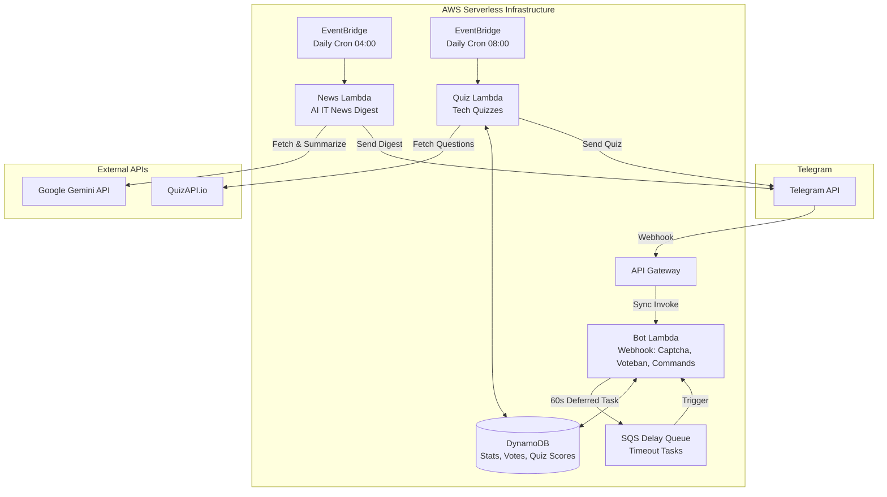

# 🛡️ Zerde Bot

**[English](README.md)** | **[Қазақша](README_kk.md)** | **[Русский](README_ru.md)**


**Zerde** — бұл IT қауымдастықтарын басқаруға арналған өндіріске дайын, серверсіз Telegram боты. Ол спамға қарсы қорғанысты, қауымдастықтағы дауыс беруді, жасанды интеллект арқылы күнделікті жаңалықтар топтамасын және интерактивті IT викториналарын бірде-бір серверді басқармай-ақ жүзеге асырады.

**Python 3.13** және **AWS CDK v2** арқылы жасалған. AWS Free Tier-де **айына $0** шығынмен 24/7 жұмыс істейді.

---

## 🌟 Серверсіз бастапқы шаблон негізінде құрастырылған ($0 Шығын)

Серверлерге ақша төлемей, осындай ботты нөлден қалай жасауға болатыны қызық па?

**Zerde Bot** — бұл AWS-те өндірістік деңгейдегі серверсіз Telegram боттарын құруға арналған ашық бастапқы **[serverless-tg-bot-starter](https://github.com/Bayashat/serverless-tg-bot-starter)** шаблоны негізінде жасалған нақты мысал.

**Ең үлкен артықшылығы? Ол айына дәл $0 тұрады.** 100% серверсіз архитектураны (API Gateway, Lambda, DynamoDB, SQS, CDK) пайдаланатындықтан, сіз тек пайдаланған ресурстарыңыз үшін ғана төлейсіз. Көптеген Telegram боттары үшін трафик толығымен жомарт AWS Free Tier шегінде қалады.

Егер сіз осындай мықты архитектурасы бар, техникалық қызмет көрсетуді және хостинг ақысын қажет етпейтін жеке ботыңызды жасағыңыз келсе, шаблоннан бастаңыз! Ол сізге дайын конфигурацияны, CI/CD және жоба құрылымын бірден ұсынады.

---

## ✨ Негізгі мүмкіндіктер

| Мүмкіндік | Сипаттамасы |
|---------|-------------|
| 🛡️ **Ақылды Captcha және Спамға қарсы** | Жаңа мүшелерді кірістірілген түйме арқылы растағанша автоматты түрде бұғаттайды. Расталмаған пайдаланушылар SQS Delay Queue арқылы **60 секундтан** кейін шығарылады. |
| 🗳️ **Қауымдастық Voteban** | Демократияландырылған модерация. Дауыс беруді бастау үшін хабарламаға `/voteban` деп жауап беріңіз. Пайдаланушыны бұғаттау немесе кешіру үшін қауымдастықтың 7 даусы қажет. |
| 📰 **Жасанды интеллект негізіндегі күнделікті жаңалықтар** | Күнделікті EventBridge cron Lambda-ны іске қосып, IT жаңалықтарын жинайды, **Google Gemini API** арқылы қазақ, орыс және қытай тілдерінде қысқаша мазмұндайды және топтарға таратады. |
| 🧠 **Интерактивті IT Викториналар** | QuizAPI-ден алынған автоматтандырылған күнделікті технологиялық викториналар. Бот жеке ұпайларды қадағалайды, күнделікті қатарынан жауап беруді (streak) сақтайды және қауымдастық көшбасшылар тақтасын ұсынады. |
| 📊 **Қауымдастық аналитикасы** | Әр топ бойынша қосылуларды, растау сәттілігінің деңгейін және модерация статистикасын кешенді қадағалау. |
| ⚡ **Нөлдік шығынды серверсіз (Zero-Cost Serverless)** | 100% код түріндегі инфрақұрылым (AWS CDK). Өте жылдам суық іске қосу (cold starts) үшін Lambda **SnapStart** пайдаланады. Толығымен AWS Free Tier аясында қалады (айына $0). |

---

## 🏗️ Архитектура

Инфрақұрылым ешқандай ортақ коды жоқ үш толық тәуелсіз Lambda функциясынан тұрады, бұл қатаң оқшаулау мен таза архитектураны қамтамасыз етеді:



| Lambda компоненті | Іске қосу көзі | Мақсаты |
|------------------|----------------|---------|
| `src/bot/` | API Gateway + SQS | Telegram webhook-терін синхронды түрде өңдейді. Captcha растауларын, voteban сессияларын, викторина ұпайларын және қауымдастық статистикасын басқарады. |
| `src/news/` | EventBridge Cron | Күнделікті жұмыс істейді (04:00 UTC). Технологиялық жаңалықтарды жинайды, AI көмегімен қысқаша мазмұндайды және мақсатты чаттарға көптілді дайджесттер жібереді. |
| `src/quiz/` | EventBridge Cron | Күнделікті жұмыс істейді (08:00 UTC). Әзірлеушілерге арналған викториналарды жинайды, қажет болса аударады және оларды қауымдастық чаттарына жібереді. |

---

## 🤖 Бот командалары

| Команда | Кімге | Сипаттамасы |
|---------|-----|-------------|
| `/start` | Барлығына | Ботты қайта іске қосу және нұсқаулықтарды көру |
| `/help` | Барлығына | Пайдалану нұсқаулығы мен ережелерді көрсету |
| `/ping` | Барлығына | Денсаулықты тексеру — боттың жұмыс істеп тұрғанын растайды |
| `/support` | Барлығына | Әзірлеушінің байланыс ақпаратын алу |
| `/stats` | Әкімшілерге | Қауымдастық статистикасы және белсенділік деңгейі |
| `/voteban` | Барлығына | Бұғаттауға дауыс беруді бастау үшін хабарламаға жауап ретінде жазу |
| `/quizstats` | Барлығына | Сіздің жеке викторина ұпайыңыз, қатарынан жауап беруіңіз және рейтингіңіз |

---

## ⚙️ CI/CD баптауы (GitHub Actions)

Бұл репозиторийде OIDC арқылы автоматты түрде орналастыруға арналған GitHub Actions жұмыс процесі бар (ұзақ мерзімді AWS кілттерін қажет етпейді).

Біз IAM конфигурациясын автоматтандыру үшін орнату сценарийін ұсынамыз:

```bash
# Пайдалану: ./scripts/setup_oidc.sh <GITHUB_ORG/REPO>
./scripts/setup_oidc.sh Bayashat/zerde-serverless-bot
```

**Бұл сценарий не істейді:**

- IAM-де OIDC провайдерін жасайды (егер жоқ болса).
- Сіздің нақты GitHub репозиторийіңізге сенім білдіретін IAM рөлін (`GitHubAction-Deploy-TelegramBot`) жасайды.
- GitHub Repository Secret ретінде қосу үшін **AWS_ROLE_ARN** шығарады.

---

## 🛠️ Үлес қосу

Біз үлес қосуға әрқашан қуаныштымыз. Әзірлеуді баптау (clone, uv, CDK, pre-commit) және PR процесі туралы білу үшін [CONTRIBUTING.md](CONTRIBUTING.md) файлын қараңыз.

Толық нұсқаулық үшін — AWS аккаунты, жаңа бот, токен, нөлден бастап орналастыру — [Жергілікті тестілеу нұсқаулығын](docs/LOCAL_TESTING.md) қараңыз.

---

## 📄 Лицензия

Бұл жоба **MIT License** бойынша лицензияланған.
