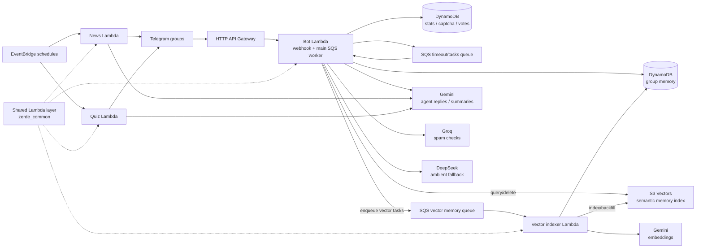

# Zerde Bot

[English](../README.md) | [Қазақша](README_kk.md) | [Русский](README_ru.md)


**Zerde** — IT қауымдастықтарына арналған serverless Telegram боты. Бұрын ол қарапайым LLM wrapper және moderation bot болатын; қазіргі бағыты — **RAG жады бар agentic group-chat bot**. Ол `/ask` сұрақтарына жауап береді, reply thread-ті түсінеді, топ контекстін есте сақтайды, ұзақ мерзімді memory-ден релевант ақпарат іздейді және чатқа қашан араласу дұрыс екенін бағалайды.

Бот әлі де captcha, anti-spam, voteban, күнделікті AI news digest және IT quiz функцияларын атқарады. Бірақ негізгі жаңа қабат — group memory және agent behavior.

---

## Не өзгерді?

Zerde енді тек “соңғы хабарламаны LLM-ге жіберетін” бот емес. Қазір онда:

- **Recent memory**: command емес топ хабарламалары DynamoDB-де `MSG#...` ретінде сақталады.
- **User profiles**: әр адамның өз хабарламаларынан алынған жеңіл profile.
- **Long-term memory**: candidate-gated және budgeted structured extraction арқылы алынатын `EVENT#...`, `USER_FACT#...`, `GROUP_FACT#...`, conservative `JOKE#...`, `DAILY_SUMMARY#...`, rule fallback бар.
- **Hybrid RAG**: long-term memory Gemini embedding арқылы S3 Vectors semantic retrieval-ге түседі, ал DynamoDB lexical fallback және local reranking exact терминдерді ұстайды.
- **Agent behavior**: `/ask`, @mention, self-reference grounding, bot жауабына reply follow-up, delayed conservative proactive reply gating, жауап ұзындығы мен style profile басқару, `/agent why` source summary.
- **Ambient reactions**: optional emoji reactions; sampled high-signal топ text хабарламаларына async `setMessageReaction` жасайды, long-term memory жазбайды.
- **Explicit media understanding**: `/ask` фото/screenshot, voice/audio, PDF және supported text/code/log файлдарға reply ретінде жұмыс істейді. Zerde топтағы әр медианы автоматты талдамайды.
- **Memory controls**: `/memory`, `/agent`, `/memory about me`, `/memory forget me`, `/memory forget this` durable source cleanup, `/agent wrong` / `/memory wrong` feedback related vector cleanup-пен, owner-only group cleanup.
- **Bot output boundary**: кәдімгі bot жауаптары тек short-term `AGENT_REPLY#...` thread metadata ретінде сақталады, semantic memory-ге embed жасалмайды. Durable bot-authored memory үшін future explicit `BOT_COMMITMENT#...` немесе `BOT_CORRECTION#...` flow қажет.

Media analysis explicit және ephemeral: bot медианы тек user `/ask` немесе explicit mention/reply path арқылы сұрағанда жүктеп талдайды, raw bytes/downloaded file сақтамайды және media-derived фактілерді long-term memory немесе S3 Vectors-ке жазбайды. Follow-up continuity үшін short-lived `AGENT_REPLY#...` ішінде тек compact media metadata/summary сақталуы мүмкін.

RAG дегеніміз — **Retrieval-Augmented Generation**: алдымен релевант memory/document іздеу, содан кейін LLM-ге сол контекстпен жауап бергізу. Zerde-де RAG — үлкенірек agentic bot архитектурасының бір қабаты.

### Chat style settings

Әр чаттың `SETTINGS` жазбасында agent жауаптарына арналған `style_profile` map бола алады: `tone`, `max_default_sentences`, `max_proactive_sentences`, `allow_light_humor`, және `low_confidence_behavior`. Default мәндер жауапты қысқа ұстайды; weak memory қолданылса, bot нақты факт сияқты сөйлемей, "қате есте сақтаған болуым мүмкін" сияқты uncertainty көрсетуі керек.

---

## Негізгі мүмкіндіктер

| Мүмкіндік | Сипаттама |
|----------|-----------|
| Group-chat agent | `/ask`, @mention және bot жауабына reply арқылы қойылған сұрақтарға requester/recent/profile/long-term/lexical/semantic memory контекстімен жауап береді. |
| Explicit multimodal `/ask` | Фото/screenshot, voice/audio, PDF немесе supported text/code/log файлға reply жасап `/ask` жіберуге болады; async worker медианы тек сол жауап үшін оқиды. |
| RAG memory | Group memory DynamoDB-де сақталады, long-term memory structured Gemini schema + rule fallback арқылы алынады, high-information memory S3 Vectors semantic retrieval үшін индекстеледі және exact-term DynamoDB fallback + local reranking қолданылады. |
| Reply thread continuity | Bot жауаптары short-term `AGENT_REPLY#...` ретінде сақталады, сондықтан follow-up сұрақтар алдыңғы жауапты біледі; бұл semantic/vector memory емес. |
| Social timing | Proactive жауаптар қысқа delay-ден кейін human-answer check, local heuristics, recent bot penalty, Gemini decision және daily limit арқылы өтеді. |
| Ambient reactions | Optional `setMessageReaction` presence feature; funny/useful/thoughtful/warm/interesting text messages үшін sampled және rate-limited emoji reaction, default on. |
| Captcha және anti-spam | Жаңа мүшелерді тексеру, rule-based және Groq арқылы spam тексеру. |
| Community voteban | `/voteban` арқылы қауымдастық дауысымен ban/forgive. |
| Daily AI news | EventBridge арқылы іске қосылатын news Lambda Gemini/DeepSeek-compatible жолдармен IT news digest жасайды. |
| IT quizzes | Scheduled және on-demand quiz Lambda көптілді developer quiz жібереді. |
| Serverless ops | AWS CDK Lambda, API Gateway, DynamoDB, SQS, EventBridge, S3 Vectors, IAM және alarms ресурстарын басқарады. |

---

## Архитектура


```mermaid
flowchart LR
  TG["Telegram groups"] --> APIGW["HTTP API Gateway"]
  APIGW --> BOT["Bot Lambda<br/>webhook + main SQS worker"]

  BOT --> STATS[("DynamoDB<br/>stats / captcha / votes")]
  BOT --> MEMORY[("DynamoDB<br/>group memory")]
  BOT --> MAINQ["SQS timeout/tasks queue"]
  MAINQ --> BOT

  BOT -- "enqueue vector tasks" --> VQ["SQS vector memory queue"]
  VQ --> VIDX["Vector indexer Lambda"]
  BOT -- "query/delete" --> S3V["S3 Vectors<br/>semantic memory index"]
  VIDX -- "index/backfill" --> S3V
  VIDX --> MEMORY

  BOT --> GEMINI["Gemini<br/>agent replies / summaries"]
  VIDX --> GEMINI_EMB["Gemini<br/>embeddings"]
  BOT --> GROQ["Groq<br/>spam checks"]
  BOT --> DEEPSEEK["DeepSeek<br/>ambient fallback"]

  EB["EventBridge schedules"] --> NEWS["News Lambda"]
  EB --> QUIZ["Quiz Lambda"]
  NEWS --> GEMINI
  QUIZ --> GEMINI
  NEWS --> TG
  QUIZ --> TG

  LAYER["Shared Lambda layer<br/>zerde_common"] -.-> BOT
  LAYER -.-> VIDX
  LAYER -.-> NEWS
  LAYER -.-> QUIZ
```

| Компонент | Trigger | Міндеті |
|-----------|---------|---------|
| `src/bot/main.py` | API Gateway + main SQS queue | Telegram webhook, captcha, voteban, spam screening, `/ask`, agent replies, group memory extraction, daily summaries, semantic retrieval, vector cleanup/enqueue. |
| `src/bot/vector_indexer_main.py` | Vector memory SQS queue | `PROCESS_VECTOR_MEMORY` және `PROCESS_VECTOR_MEMORY_BACKFILL` үшін dedicated consumer; memory-ді S3 Vectors-ке embed/index етеді және backfill pages fan-out жасайды. |
| `src/news/` | EventBridge | Көптілді IT news digest. |
| `src/quiz/` | EventBridge + bot invoke | Scheduled және on-demand developer quizzes. |
| `src/shared/python/zerde_common/` | Lambda layer | Ортақ config, secret loading, logging, redaction, provider error helpers. |
| `infra/` | CDK | Serverless infrastructure, queues, tables, vector bucket/index, alarms, Lambda wiring. |

Bot Lambda retrieval және memory cleanup үшін S3 Vectors query/delete жасай алады, бірақ vector memory queue consumer емес.

Толығырақ developer map: [ARCHITECTURE.md](ARCHITECTURE.md).

---

## Bot командалары

| Команда | Кімге | Сипаттама |
|---------|------|-----------|
| `/start` | Барлығына | Ботты қайта бастау және нұсқаулық көру. |
| `/help` | Барлығына | Командалар мен ережелер. |
| `/ping` | Барлығына | Health check. |
| `/support` | Барлығына | Developer contact. |
| `/stats` | Admins | Community статистикасы. |
| `/voteban` | Барлығына | Reply арқылы ban vote бастау. |
| `/quizstats` | Барлығына | Жеке quiz score, streak, rank. |
| `/ask <question>` | Memory қосылған топтарда | Agent-ке сұрақ қою; басқа хабарламаға, image/screenshot, voice/audio, PDF немесе supported text/code/log файлға reply ретінде де қолдануға болады. Media тек explicit жауап үшін талданады және default бойынша long-term/vector memory емес. |
| `/memory about me` | Барлығына | Current user-дің өз хабарламаларынан сақталған profile fields көрсету; басқа адамдардың бағасын көрсетпейді. |
| `/memory on/off/status/forget .../wrong` | Settings үшін group owner немесе bot owner; users өз memory өшіре алады немесе answer source-тарын wrong деп белгілей алады | Group memory басқару және cleanup. `forget this` bot answer-ден durable long-term memory ғана өшіреді немесе source message-ке тікелей reply болса raw/derived memory өшіреді; `USER#` profile өшірмейді. `wrong` reply жасалған bot answer memory source-тарын өшірмей қате деп белгілейді. |
| `/agent on/off/status/why/wrong` | Settings үшін group owner немесе bot owner; users replied answer source-тарын тексере/белгілей алады | Agent participation басқару және bot неге жауап бергенін көру; memory source түрлері/count көрсетіледі, толық memory text көрсетілмейді. `/agent wrong` reply жасалған bot answer memory source-тарын қате деп белгілейді. `/agent off` proactive, mention және reply-thread қатысуын өшіреді; жад қосулы болса, `/ask` қолжетімді. |

---

## Әзірлеу

```bash
uv sync --frozen
uv run pytest tests/ -q
uv run pre-commit run --all-files
```

Infra тексеру:

```bash
cd infra
uv run cdk synth -c env=dev
uv run cdk diff -c env=dev
```

Setup үшін [CONTRIBUTING.md](../CONTRIBUTING.md), толық AWS + Telegram walkthrough үшін [LOCAL_TESTING.md](LOCAL_TESTING.md) қараңыз.

---

## Тарих

Zerde бастапқыда [serverless-tg-bot-starter](https://github.com/Bayashat/serverless-tg-bot-starter) негізінде жасалған. Ол starter қарапайым serverless Telegram bot үшін әлі де пайдалы. Бұл репозиторий кейін memory-enabled agentic bot, news және quiz workload-тары бар толық жүйеге айналды.

---

## License

MIT License.
