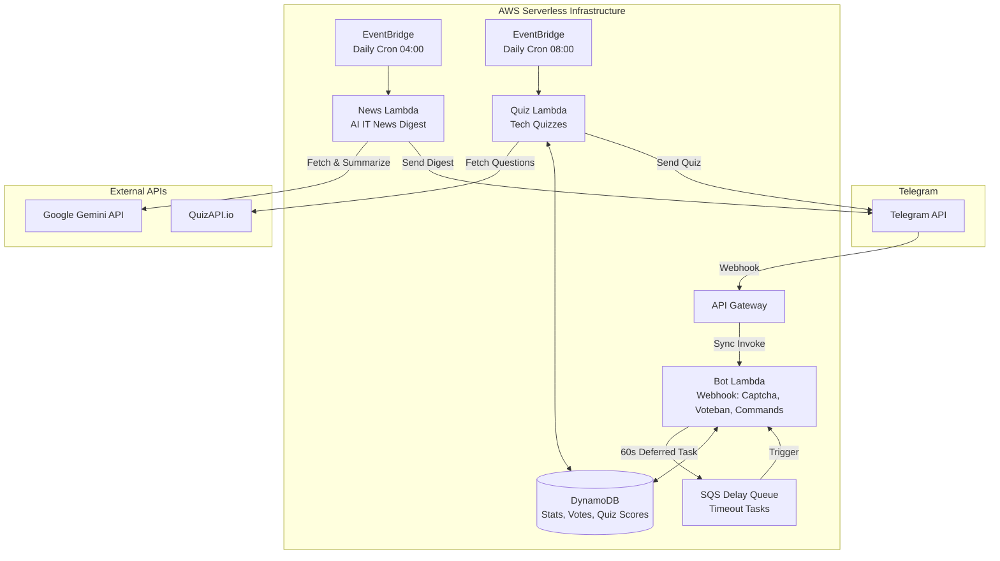

# 🛡️ Zerde Bot

**[English](README.md)** | **[Қазақша](README_kk.md)** | **[Русский](README_ru.md)**


**Zerde** — это готовый к использованию в рабочей среде бессерверный Telegram-бот для управления IT-сообществами. Он обрабатывает защиту от спама, голосования сообщества, ежедневные подборки новостей на базе ИИ и интерактивные технические викторины, и всё это без управления серверами.

Создан с использованием **Python 3.13** и **AWS CDK v2**. Работает 24/7 на уровне AWS Free Tier с затратами **$0/мес**.

---

## 🌟 Создан на базе бессерверного шаблона (Затраты $0)

Интересно, как создать подобного бота с нуля, не платя за серверы?

**Zerde Bot** — это реальная реализация, построенная на базе **[serverless-tg-bot-starter](https://github.com/Bayashat/serverless-tg-bot-starter)** — опенсорсного шаблона для создания production-ready бессерверных Telegram-ботов на AWS.

**Главное преимущество? Это стоит ровно $0 в месяц.** Поскольку используется 100% бессерверная архитектура (API Gateway, Lambda, DynamoDB, SQS, CDK), вы платите только за то, что используете. Для большинства Telegram-ботов трафик полностью укладывается в щедрые рамки AWS Free Tier.

Если вы хотите создать своего собственного бота с такой же надежной архитектурой, отсутствием необходимости в обслуживании и нулевыми затратами на хостинг, начните с этого шаблона! Он предоставляет готовую инфраструктуру, CI/CD и структуру проекта прямо из коробки.

---

## ✨ Ключевые возможности

| Функция | Описание |
|---------|-------------|
| 🛡️ **Умная Captcha и антиспам** | Автоматически мутит новых участников, пока они не подтвердят себя через inline-кнопку. Неподтвержденные пользователи удаляются через **60 секунд** с помощью очереди задержки SQS. |
| 🗳️ **Общественный Voteban** | Демократизированная модерация. Ответьте на сообщение командой `/voteban`, чтобы начать голосование. Требуется 7 голосов сообщества, чтобы забанить или простить пользователя. |
| 📰 **Ежедневные новости на базе ИИ** | Ежедневный cron EventBridge запускает Lambda для сбора IT-новостей, делает их краткую сводку через **Google Gemini API** на казахском, русском и китайском языках и рассылает по группам. |
| 🧠 **Интерактивные IT-викторины** | Автоматизированные ежедневные технические викторины из QuizAPI. Бот отслеживает индивидуальные баллы, серии ответов и ведет таблицу лидеров сообщества. |
| 📊 **Аналитика сообщества** | Комплексное отслеживание присоединений, уровня успешных верификаций и статистики модерации по группам. |
| ⚡ **Zero-Cost Serverless** | 100% Infrastructure as Code (AWS CDK). Использует Lambda **SnapStart** для сверхбыстрого холодного запуска. Полностью остается в рамках AWS Free Tier ($0/мес). |

---

## 🏗️ Архитектура

Инфраструктура состоит из трех полностью независимых функций Lambda, не имеющих общего кода, что обеспечивает строгую изоляцию и чистую архитектуру:



| Компонент Lambda | Источник триггера | Назначение |
|------------------|----------------|---------|
| `src/bot/` | API Gateway + SQS | Синхронно обрабатывает вебхуки Telegram. Управляет верификацией капчи, сессиями voteban, подсчетом очков в викторинах и статистикой сообщества. |
| `src/news/` | EventBridge Cron | Запускается ежедневно (04:00 UTC). Собирает новости технологий, делает их сводку с помощью ИИ и отправляет мультиязычные дайджесты в целевые чаты. |
| `src/quiz/` | EventBridge Cron | Запускается ежедневно (08:00 UTC). Собирает викторины для разработчиков, при необходимости переводит их и рассылает в чаты сообщества. |

---

## 🤖 Команды бота

| Команда | Для кого | Описание |
|---------|-----|-------------|
| `/start` | Для всех | Перезапустить бота и просмотреть инструкции |
| `/help` | Для всех | Показать руководство по использованию и правила |
| `/ping` | Для всех | Проверка работоспособности — подтверждает, что бот активен |
| `/support` | Для всех | Получить контактную информацию разработчика |
| `/stats` | Админы | Статистика сообщества и уровень активности |
| `/voteban` | Для всех | Ответить на сообщение, чтобы начать голосование за бан |
| `/quizstats` | Для всех | Ваш личный счет в викторинах, серия и рейтинг |

---

## ⚙️ Настройка CI/CD (GitHub Actions)

Этот репозиторий включает рабочий процесс GitHub Actions для автоматического развертывания через OIDC (без долгоживущих ключей AWS).

Мы предоставляем скрипт настройки для автоматизации конфигурации IAM:

```bash
# Использование: ./scripts/setup_oidc.sh <GITHUB_ORG/REPO>
./scripts/setup_oidc.sh Bayashat/zerde-serverless-bot
```

**Что делает этот скрипт:**

- Создает провайдер OIDC в IAM (если отсутствует).
- Создает роль IAM (`GitHubAction-Deploy-TelegramBot`), которая доверяет вашему конкретному репозиторию GitHub.
- Выводит **AWS_ROLE_ARN** для добавления в качестве секрета репозитория (Repository Secret) на GitHub.

---

## 🛠️ Участие в разработке

Мы приветствуем ваш вклад. Ознакомьтесь с [CONTRIBUTING.md](CONTRIBUTING.md) для настройки среды разработки (clone, uv, CDK, pre-commit) и процессом создания PR.

Для полного пошагового руководства — аккаунт AWS, новый бот, токен, развертывание с нуля — см. [Руководство по локальному тестированию](docs/LOCAL_TESTING.md).

---

## 📄 Лицензия

Этот проект лицензирован в соответствии с **MIT License**.
