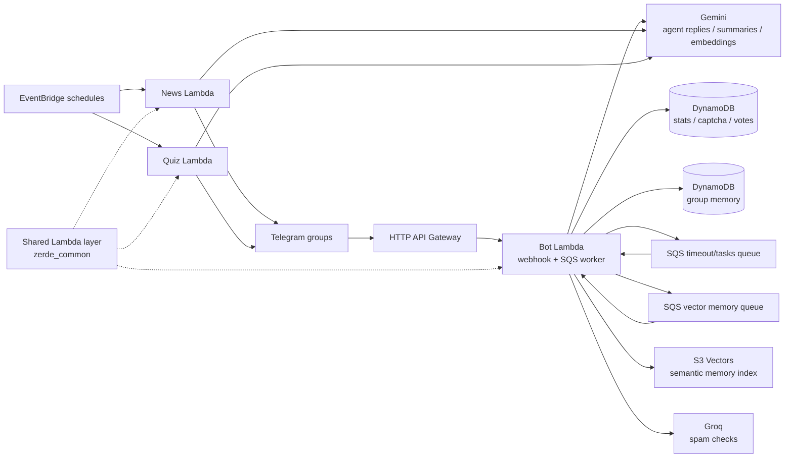

# Zerde Bot

[English](../README.md) | [Қазақша](README_kk.md) | [Русский](README_ru.md)


**Zerde** — serverless Telegram-бот для IT-сообществ. Раньше он был простым LLM wrapper и ботом для модерации; сейчас это **agentic group-chat bot с RAG-памятью**. Он отвечает на `/ask`, понимает reply threads, помнит контекст группы, достает релевантные долгосрочные воспоминания и решает, когда уместно вступить в разговор.

Бот по-прежнему поддерживает captcha, anti-spam, voteban, ежедневные AI news digest и IT quizzes. Главный новый слой — group memory и agent behavior.

---

## Что изменилось?

Zerde больше не просто отправляет последнее сообщение в LLM. Сейчас в нем есть:

- **Recent memory**: не-command сообщения группы хранятся в DynamoDB как `MSG#...`.
- **User profiles**: легкий профиль пользователя, построенный только из его собственных сообщений.
- **Long-term memory**: `EVENT#...`, `USER_FACT#...`, `GROUP_FACT#...`, `JOKE#...`, `DAILY_SUMMARY#...`.
- **Hybrid RAG**: long-term memory эмбеддится через Gemini для S3 Vectors semantic retrieval, плюс DynamoDB lexical fallback и local reranking.
- **Agent behavior**: `/ask`, @mention, self-reference grounding, follow-up через reply на ответ бота, conservative proactive reply gating, контроль длины ответа, `/agent why`.
- **Memory controls**: `/memory`, `/agent`, `/memory forget me` с related vector/summary cleanup, owner-only group cleanup.

RAG означает **Retrieval-Augmented Generation**: сначала найти релевантную память или документы, затем дать LLM этот контекст для ответа. В Zerde RAG — один слой внутри более широкой agentic bot архитектуры.

---

## Ключевые возможности

| Функция | Описание |
|---------|----------|
| Group-chat agent | Отвечает на `/ask`, @mentions и replies на сообщения бота с учетом requester/recent/profile/long-term/lexical/semantic memory. |
| RAG memory | Group memory хранится в DynamoDB, long-term memory индексируется в S3 Vectors для semantic retrieval, а exact-term DynamoDB fallback и local reranking улучшают точные запросы. |
| Reply thread continuity | Ответы бота сохраняются как `AGENT_REPLY#...`, поэтому follow-up вопросы знают предыдущий ответ. |
| Social timing | Proactive replies проходят local heuristics, штраф за недавнюю активность бота, Gemini decision и daily limit. |
| Captcha и anti-spam | Проверка новых участников, rule-based spam screening и Groq checks. |
| Community voteban | `/voteban` позволяет сообществу голосовать за ban/forgive. |
| Daily AI news | News Lambda по EventBridge делает IT news digest через Gemini/DeepSeek-compatible paths. |
| IT quizzes | Scheduled и on-demand quiz Lambda отправляет multilingual developer quizzes. |
| Serverless ops | AWS CDK управляет Lambda, API Gateway, DynamoDB, SQS, EventBridge, S3 Vectors, IAM и alarms. |

---

## Архитектура


```mermaid
flowchart LR
  TG["Telegram groups"] --> APIGW["HTTP API Gateway"]
  APIGW --> BOT["Bot Lambda<br/>webhook + SQS worker"]

  BOT --> STATS[("DynamoDB<br/>stats / captcha / votes")]
  BOT --> MEMORY[("DynamoDB<br/>group memory")]
  BOT --> MAINQ["SQS timeout/tasks queue"]
  MAINQ --> BOT

  BOT --> VQ["SQS vector memory queue"]
  VQ --> BOT
  BOT --> S3V["S3 Vectors<br/>semantic memory index"]

  BOT --> GEMINI["Gemini<br/>agent replies / summaries / embeddings"]
  BOT --> GROQ["Groq<br/>spam checks"]

  EB["EventBridge schedules"] --> NEWS["News Lambda"]
  EB --> QUIZ["Quiz Lambda"]
  NEWS --> GEMINI
  QUIZ --> GEMINI
  NEWS --> TG
  QUIZ --> TG

  LAYER["Shared Lambda layer<br/>zerde_common"] -.-> BOT
  LAYER -.-> NEWS
  LAYER -.-> QUIZ
```

| Компонент | Trigger | Ответственность |
|-----------|---------|-----------------|
| `src/bot/` | API Gateway + SQS | Telegram webhook, captcha, voteban, spam screening, `/ask`, agent replies, memory writes, vector indexing tasks. |
| `src/news/` | EventBridge | Мультиязычный IT news digest. |
| `src/quiz/` | EventBridge + bot invoke | Scheduled и on-demand developer quizzes. |
| `src/shared/python/zerde_common/` | Lambda layer | Общие config, secret loading, logging, redaction, provider error helpers. |
| `infra/` | CDK | Serverless infrastructure, queues, tables, vector bucket/index, alarms, Lambda wiring. |

Подробная карта для разработки: [ARCHITECTURE.md](ARCHITECTURE.md).

---

## Команды бота

| Команда | Для кого | Описание |
|---------|----------|----------|
| `/start` | Все | Перезапустить бота и показать инструкции. |
| `/help` | Все | Команды и правила. |
| `/ping` | Все | Health check. |
| `/support` | Все | Контакты разработчика. |
| `/stats` | Admins | Статистика сообщества. |
| `/voteban` | Все | Начать голосование за ban, ответив на сообщение. |
| `/quizstats` | Все | Личный quiz score, streak и rank. |
| `/ask <question>` | В memory-enabled группах | Задать вопрос agent-у; можно использовать reply на сообщение, включая self-reference вроде “кто я”. |
| `/memory on/off/status/forget ...` | Group owner или bot owner | Управление group memory и cleanup, включая user-related vectors и matching daily summaries. |
| `/agent on/off/status/why` | Group owner или bot owner | Управление участием agent-а и объяснение, почему бот ответил. `/agent off` выключает proactive, mention и reply-thread участие; `/ask` остается доступен, если память включена. |

---

## Разработка

```bash
uv sync --frozen
uv run pytest tests/ -q
uv run pre-commit run --all-files
```

Проверка infra:

```bash
cd infra
uv run cdk synth -c env=dev
uv run cdk diff -c env=dev
```

Setup описан в [CONTRIBUTING.md](../CONTRIBUTING.md), полный AWS + Telegram walkthrough — в [LOCAL_TESTING.md](LOCAL_TESTING.md).

---

## История

Zerde изначально был построен на базе [serverless-tg-bot-starter](https://github.com/Bayashat/serverless-tg-bot-starter). Starter все еще полезен для простых serverless Telegram-ботов. Этот репозиторий вырос в memory-enabled agentic bot с отдельными news и quiz workloads.

---

## License

MIT License.
