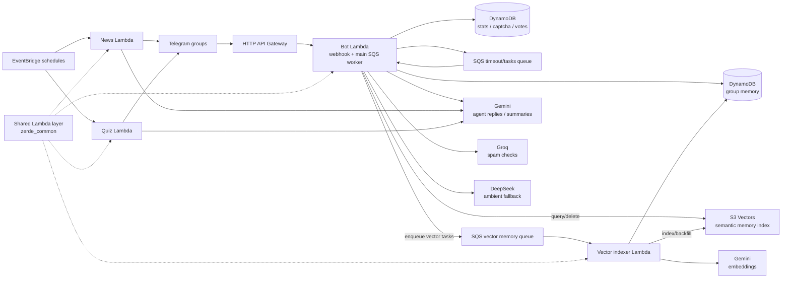

# Zerde Bot

[English](../README.md) | [Қазақша](README_kk.md) | [Русский](README_ru.md)


**Zerde** — serverless Telegram-бот для IT-сообществ. Раньше он был простым LLM wrapper и ботом для модерации; сейчас это **agentic group-chat bot с RAG-памятью**. Он отвечает на `/ask`, понимает reply threads, помнит контекст группы, достает релевантные долгосрочные воспоминания и решает, когда уместно вступить в разговор.

Бот по-прежнему поддерживает captcha, anti-spam, voteban, ежедневные AI news digest и IT quizzes. Главный новый слой — group memory и agent behavior.

---

## Что изменилось?

Zerde больше не просто отправляет последнее сообщение в LLM. Сейчас в нем есть:

- **Recent memory**: не-command сообщения группы хранятся в DynamoDB как `MSG#...`.
- **User profiles**: легкий профиль пользователя, построенный только из его собственных сообщений.
- **Long-term memory**: `EVENT#...`, `USER_FACT#...`, `GROUP_FACT#...`, conservative `JOKE#...`, `DAILY_SUMMARY#...`, извлекаемые через candidate-gated и budgeted structured extraction с rule fallback.
- **Hybrid RAG**: long-term memory эмбеддится через Gemini для S3 Vectors semantic retrieval, плюс DynamoDB lexical fallback и local reranking.
- **Agent behavior**: `/ask`, @mention, self-reference grounding, follow-up через reply на ответ бота, immediate linked-channel post comments, delayed conservative ordinary proactive reply gating, контроль длины и style profile ответа, `/agent why` source summary.
- **Ambient reactions**: optional emoji reactions; async `setMessageReaction` без записи long-term memory. Ordinary messages sampled/rate-limited, а linked-channel post всегда получает reaction attempt с 👀 fallback при необходимости.
- **Explicit media understanding**: `/ask` можно использовать reply на фото/screenshot, voice/audio, PDF и supported text/code/log файлы. Linked-channel post comment path может ephemeral анализировать attached media. Zerde не анализирует автоматически обычные медиа в группе.
- **Memory controls**: `/memory`, `/agent`, `/memory about me`, `/memory forget me`, `/memory forget this` для durable source cleanup, `/agent wrong` / `/memory wrong` feedback с related vector cleanup, owner-only group cleanup.
- **Bot output boundary**: обычные ответы бота хранятся только как short-term `AGENT_REPLY#...` thread metadata и не эмбеддятся в semantic memory. Durable bot-authored memory зарезервирована для future explicit `BOT_COMMITMENT#...` или `BOT_CORRECTION#...` flows.

Media analysis является explicit и ephemeral: бот скачивает и анализирует медиа только когда user явно просит через `/ask` или explicit mention/reply path, а также внутри official linked-channel post comment path. Raw bytes/downloaded files не сохраняются, media-derived факты не записываются в long-term memory или S3 Vectors. Для follow-up continuity в short-lived `AGENT_REPLY#...` может сохраняться только compact media metadata/summary.

RAG означает **Retrieval-Augmented Generation**: сначала найти релевантную память или документы, затем дать LLM этот контекст для ответа. В Zerde RAG — один слой внутри более широкой agentic bot архитектуры.

### Chat style settings

В `SETTINGS` каждой группы может быть `style_profile` для ответов agent-а: `tone`, `max_default_sentences`, `max_proactive_sentences`, `allow_light_humor` и `low_confidence_behavior`. Значения по умолчанию оставляют ответы короткими; если выбранная memory слабая, bot должен показывать неопределенность, например "могу помнить это неточно", а не говорить как о точном факте.

---

## Ключевые возможности

| Функция | Описание |
|---------|----------|
| Group-chat agent | Отвечает на `/ask`, @mentions и replies на сообщения бота с учетом requester/recent/profile/long-term/lexical/semantic memory. |
| Explicit multimodal `/ask` | Можно ответить `/ask` на фото/screenshot, voice/audio, PDF или supported text/code/log file; async worker читает медиа только для текущего ответа. |
| RAG memory | Group memory хранится в DynamoDB, long-term memory извлекается через structured Gemini schema + rule fallback, high-information memory индексируется в S3 Vectors для semantic retrieval, а exact-term DynamoDB fallback и local reranking улучшают точные запросы. |
| Reply thread continuity | Ответы бота сохраняются как short-term `AGENT_REPLY#...`, поэтому follow-up вопросы знают предыдущий ответ; эти записи не являются semantic/vector memory. |
| Social timing | Ordinary proactive replies ждут короткий delay, затем проходят human-answer check, local heuristics, штраф за недавнюю активность бота, Gemini decision и daily limit. Linked-channel post обрабатывается отдельным zero-delay comment path и может ephemeral анализировать supported attached media. |
| Ambient reactions | Optional `setMessageReaction` presence feature; ordinary funny/useful/thoughtful/warm/interesting messages получают sampled/rate-limited emoji reaction, а linked-channel post всегда получает reaction attempt. |
| Captcha и anti-spam | Проверка новых участников, rule-based spam screening и Groq checks. |
| Community voteban | `/voteban` позволяет сообществу голосовать за ban/forgive. |
| Daily AI news | News Lambda по EventBridge делает IT news digest через Gemini/DeepSeek-compatible paths. |
| IT quizzes | Scheduled и on-demand quiz Lambda отправляет multilingual developer quizzes. |
| Serverless ops | AWS CDK управляет Lambda, API Gateway, DynamoDB, SQS, EventBridge, S3 Vectors, IAM и alarms. |

---

## Архитектура


```mermaid
flowchart LR
  TG["Telegram groups"] --> APIGW["HTTP API Gateway"]
  APIGW --> BOT["Bot Lambda<br/>webhook + main SQS worker"]

  BOT --> STATS[("DynamoDB<br/>stats / captcha / votes")]
  BOT --> MEMORY[("DynamoDB<br/>group memory")]
  BOT --> MAINQ["SQS timeout/tasks queue"]
  MAINQ --> BOT

  BOT -- "enqueue vector tasks" --> VQ["SQS vector memory queue"]
  VQ --> VIDX["Vector indexer Lambda"]
  BOT -- "query/delete" --> S3V["S3 Vectors<br/>semantic memory index"]
  VIDX -- "index/backfill" --> S3V
  VIDX --> MEMORY

  BOT --> GEMINI["Gemini<br/>agent replies / summaries"]
  VIDX --> GEMINI_EMB["Gemini<br/>embeddings"]
  BOT --> GROQ["Groq<br/>spam checks"]
  BOT --> DEEPSEEK["DeepSeek<br/>ambient fallback"]

  EB["EventBridge schedules"] --> NEWS["News Lambda"]
  EB --> QUIZ["Quiz Lambda"]
  NEWS --> GEMINI
  QUIZ --> GEMINI
  NEWS --> TG
  QUIZ --> TG

  LAYER["Shared Lambda layer<br/>zerde_common"] -.-> BOT
  LAYER -.-> VIDX
  LAYER -.-> NEWS
  LAYER -.-> QUIZ
```

| Компонент | Trigger | Ответственность |
|-----------|---------|-----------------|
| `src/bot/main.py` | API Gateway + main SQS queue | Telegram webhook, captcha, voteban, spam screening, `/ask`, agent replies, group memory extraction, daily summaries, semantic retrieval, vector cleanup/enqueue. |
| `src/bot/vector_indexer_main.py` | Vector memory SQS queue | Dedicated consumer для `PROCESS_VECTOR_MEMORY` и `PROCESS_VECTOR_MEMORY_BACKFILL`; делает embeddings/indexing в S3 Vectors и fan-out backfill pages. |
| `src/news/` | EventBridge | Мультиязычный IT news digest. |
| `src/quiz/` | EventBridge + bot invoke | Scheduled и on-demand developer quizzes. |
| `src/shared/python/zerde_common/` | Lambda layer | Общие config, secret loading, logging, redaction, provider error helpers. |
| `infra/` | CDK | Serverless infrastructure, queues, tables, vector bucket/index, alarms, Lambda wiring. |

Bot Lambda может query/delete S3 Vectors для retrieval и memory cleanup, но не потребляет сообщения из vector memory queue.

Подробная карта для разработки: [ARCHITECTURE.md](ARCHITECTURE.md).

---

## Команды бота

| Команда | Для кого | Описание |
|---------|----------|----------|
| `/start` | Все | Перезапустить бота и показать инструкции. |
| `/help` | Все | Команды и правила. |
| `/ping` | Все | Health check. |
| `/support` | Все | Контакты разработчика. |
| `/stats` | Admins | Статистика сообщества. |
| `/voteban` | Все | Начать голосование за ban, ответив на сообщение. |
| `/quizstats` | Все | Личный quiz score, streak и rank. |
| `/ask <question>` | В memory-enabled группах | Задать вопрос agent-у; можно использовать reply на сообщение, image/screenshot, voice/audio, PDF или supported text/code/log file. Media анализируется только для explicit ответа и по умолчанию не пишется в long-term/vector memory. |
| `/memory about me` | Все | Показать profile fields текущего пользователя, сохраненные из его собственных сообщений, без чужих оценок. |
| `/memory on/off/status/forget .../wrong` | Group owner или bot owner для settings; users могут удалить свою memory или отметить answer sources как wrong | Управление group memory и cleanup. `forget this` удаляет durable long-term memory из replied bot answer или raw/derived memory при прямом reply на source message; `USER#` profile не удаляется. `wrong` помечает источники памяти replied bot answer как ошибочные без удаления. |
| `/agent on/off/status/why/wrong` | Group owner или bot owner для settings; users могут inspect или отметить replied answer sources | Управление участием agent-а и объяснение, почему бот ответил, включая типы/count источников памяти без полного текста memory. `/agent wrong` помечает источники памяти replied bot answer как ошибочные. `/agent off` выключает proactive, mention и reply-thread участие; `/ask` остается доступен, если память включена. |

---

## Разработка

```bash
uv sync --frozen
uv run pytest tests/ -q
uv run pre-commit run --all-files
```

Проверка infra:

```bash
cd infra
uv run cdk synth -c env=dev
uv run cdk diff -c env=dev
```

Setup описан в [CONTRIBUTING.md](../CONTRIBUTING.md), полный AWS + Telegram walkthrough — в [LOCAL_TESTING.md](LOCAL_TESTING.md).

---

## История

Zerde изначально был построен на базе [serverless-tg-bot-starter](https://github.com/Bayashat/serverless-tg-bot-starter). Starter все еще полезен для простых serverless Telegram-ботов. Этот репозиторий вырос в memory-enabled agentic bot с отдельными news и quiz workloads.

---

## License

MIT License.
